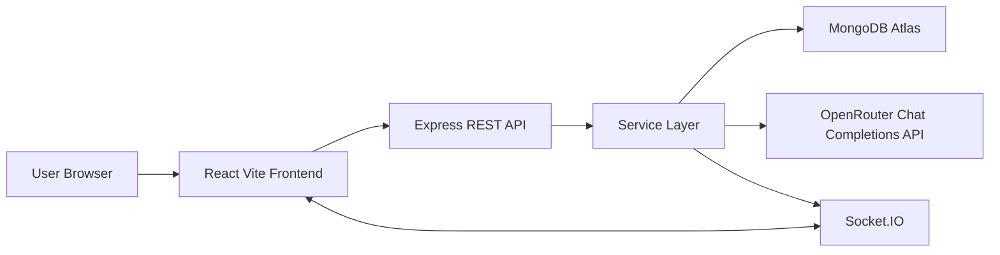

# WorkOS - AI-Assisted Team Task Manager

Production-level full-stack project management system with RBAC, real-time collaboration, analytics, audit logs, notifications, and practical AI assistance powered by OpenRouter.

## 1. Project Snapshot

| Item | Details |
|---|---|
| Project Name | WorkOS - AI-Assisted Team Task Manager |
| Project Type | Full-stack SaaS-style task management application |
| Primary Goal | Demonstrate production-ready architecture, clean backend design, scalable patterns, and meaningful AI integration |
| Frontend | React, Vite, Socket.IO Client, `@hello-pangea/dnd` |
| Backend | Node.js, Express, Socket.IO, JWT, Zod |
| Database | MongoDB Atlas, Mongoose |
| AI Provider | OpenRouter Chat Completions API with structured JSON outputs |
| Deployment | Railway backend, Vercel or Railway frontend, MongoDB Atlas database |
| Status | Implemented core product with professional documentation |

## 2. Why This Project Is Interview-Worthy

| Area | What It Demonstrates |
|---|---|
| Backend Architecture | Controller -> Service -> Model layering with isolated business logic. |
| Security | JWT auth, password hashing, email verification, RBAC middleware, input validation, no hardcoded secrets. |
| Real-Time System Design | Project rooms and user notification rooms with Socket.IO. |
| Data Modeling | Relational-style document schemas using Mongoose references and indexes. |
| AI Integration | AI is used only for reasoning-heavy workflows, not deterministic rules. |
| Observability | Activity logs and consistent error handling. |
| Analytics | Completion rate, overdue tasks, average completion time, team workload. |
| Deployment Readiness | Env examples, Railway config, Vercel rewrite config, setup instructions. |

## 3. Feature Matrix

| Feature Area | Capability | Status | Key Files |
|---|---|---:|---|
| Authentication | Signup, login, email verification, strong password policy, Google OAuth, JWT session, current user | Done | `backend/src/services/authService.js`, `frontend/src/state/AuthContext.jsx` |
| RBAC | Admin, manager, member permission guards | Done | `backend/src/middlewares/rbac.js`, `backend/src/services/taskService.js` |
| Projects | Create, list, view, update, delete | Done | `backend/src/services/projectService.js`, `frontend/src/pages/Projects.jsx` |
| Members | Add/remove project members | Done | `backend/src/routes/projectRoutes.js`, `frontend/src/components/MemberManager.jsx` |
| Tasks | Create, assign, update status, delete | Done | `backend/src/services/taskService.js`, `frontend/src/components/KanbanBoard.jsx` |
| Kanban | Drag/drop Todo, In Progress, Done | Done | `frontend/src/components/KanbanBoard.jsx` |
| Notifications | Assignment and overdue notifications | Done | `backend/src/services/notificationService.js` |
| Real-Time | Task and notification socket events | Done | `backend/src/socket/socket.js`, `frontend/src/api/socket.js` |
| Activity Log | Audit trail for project/task/member actions | Done | `backend/src/services/activityService.js` |
| Dashboard | Metrics and workload analytics | Done | `backend/src/services/dashboardService.js`, `frontend/src/pages/Dashboard.jsx` |
| AI Breakdown | Natural language goal to subtasks | Done | `backend/src/services/aiService.js` |
| AI Description | Task title to detailed task plan | Done | `frontend/src/components/TaskForm.jsx` |
| AI Suggestions | Context-aware missing task suggestions | Done | `frontend/src/components/AiPanel.jsx` |
| AI Chat | Project-state assistant | Done | `backend/src/controllers/aiController.js` |
| AI Summary | Progress, delays, risks, next steps | Done | `backend/src/services/aiService.js` |

## 4. Documentation Pack

| Document | Purpose |
|---|---|
| [SRC - Software Requirements and Context](docs/SRC.md) | Complete requirement, scope, role, feature, and success-criteria document. |
| [HLD - High-Level Design](docs/HLD.md) | System architecture, component diagrams, deployment design, security, scalability. |
| [LLD - Low-Level Design](docs/LLD.md) | Module-level design, schema details, APIs, services, frontend components, flows. |

## 5. Architecture at a Glance



| Layer | Responsibility |
|---|---|
| React Frontend | UI, routing, Kanban drag/drop, forms, AI panel, socket subscriptions. |
| Express Routes | HTTP endpoint declaration and middleware composition. |
| Controllers | Thin request/response handlers. |
| Services | Business rules, database orchestration, notifications, analytics, AI integration. |
| Models | Mongoose schemas, references, indexes. |
| Socket.IO | Real-time task and notification events. |
| OpenRouter | Cost-controlled structured reasoning output for AI-assisted productivity features. |

## 6. Deterministic Logic vs AI Logic

| Deterministic Backend Logic | AI-Assisted Reasoning |
|---|---|
| Authentication and JWT verification | Task breakdown from natural language. |
| Role-based authorization | Detailed task description generation. |
| Project and member access checks | Context-aware task suggestions. |
| Task status transitions | Project-state chat assistant. |
| Dashboard metrics | Human-readable project summary. |
| Overdue detection | Risk and next-step recommendations. |
| Notifications and activity logs | Advisory output only, no direct database writes. |

## 7. Repository Structure

```txt
workos/
  backend/
    src/
      config/          # Environment, MongoDB, OpenRouter client
      controllers/     # HTTP request/response handlers
      middlewares/     # Auth, RBAC, validation, errors
      models/          # Mongoose schemas
      routes/          # API routes
      services/        # Business logic and AI boundary
      socket/          # Socket.IO helpers
      utils/           # AppError, asyncHandler
      validators/      # Zod request schemas
      app.js
      server.js
  frontend/
    src/
      api/             # Axios and Socket.IO clients
      components/      # Layout, Kanban, AI panel, forms
      pages/           # Login, dashboard, projects, project detail
      state/           # Auth context
  docs/
    SRC.md
    HLD.md
    LLD.md
```

## 8. Backend API Summary

| Method | Endpoint | Auth | Roles | Purpose |
|---|---|---:|---|---|
| POST | `/api/auth/signup` | No | Public | Create account. |
| POST | `/api/auth/login` | No | Public | Login and receive JWT. |
| POST | `/api/auth/google` | No | Public | Verify Google ID token and receive JWT. |
| GET | `/api/auth/me` | Yes | All | Get current user. |
| GET | `/api/projects` | Yes | All | List accessible projects. |
| POST | `/api/projects` | Yes | Admin, Manager | Create project. |
| GET | `/api/projects/:projectId` | Yes | All | Get project details. |
| PATCH | `/api/projects/:projectId` | Yes | Admin, Manager | Update project. |
| DELETE | `/api/projects/:projectId` | Yes | Admin, Manager | Delete project. |
| POST | `/api/projects/:projectId/members/:memberId` | Yes | Admin, Manager | Add member. |
| DELETE | `/api/projects/:projectId/members/:memberId` | Yes | Admin, Manager | Remove member. |
| GET | `/api/tasks/project/:projectId` | Yes | All | List project tasks. |
| POST | `/api/tasks` | Yes | Admin, Manager | Create task. |
| PATCH | `/api/tasks/:taskId` | Yes | All | Update task, member restricted. |
| DELETE | `/api/tasks/:taskId` | Yes | Admin, Manager | Delete task. |
| GET | `/api/dashboard` | Yes | All | Get analytics overview. |
| GET | `/api/notifications` | Yes | All | List notifications. |
| PATCH | `/api/notifications/:notificationId/read` | Yes | All | Mark notification read. |

## 9. AI API Summary

| Method | Endpoint | Input | Output |
|---|---|---|---|
| POST | `/api/ai/breakdown` | `goal`, optional `projectId` | Structured subtasks. |
| POST | `/api/ai/description` | `title`, optional `projectId` | Description, steps, edge cases, acceptance criteria. |
| GET | `/api/ai/projects/:projectId/suggestions` | Project id | Suggested missing tasks. |
| POST | `/api/ai/projects/:projectId/chat` | Project id, question | Answer, recommended actions, risks. |
| GET | `/api/ai/projects/:projectId/summary` | Project id | Summary, progress, delays, risks, next steps. |

## 10. Data Model Summary

| Model | Purpose | Key Relationships |
|---|---|---|
| User | Auth identity and role. | Creates projects, belongs to projects, assigned to tasks. |
| Project | Team workspace. | Created by user, has members, contains tasks. |
| Task | Work item. | Belongs to project, optionally assigned to user. |
| ActivityLog | Audit event. | Linked to actor and project. |
| Notification | User alert. | Linked to recipient, optional task/project. |

## 11. Local Setup

### 11.1 Prerequisites

| Tool | Recommended |
|---|---|
| Node.js | 20+ |
| npm | 10+ |
| MongoDB | MongoDB Atlas or local MongoDB |
| OpenRouter API Key | Required only for AI endpoints |

### 11.2 Install Dependencies

```bash
npm run install:all
```

### 11.3 Backend Environment

Create `backend/.env` from `backend/.env.example`.

| Variable | Example | Required | Purpose |
|---|---|---:|---|
| `NODE_ENV` | `development` | No | Runtime environment. |
| `PORT` | `5000` | No | Backend port. |
| `CLIENT_URL` | `http://localhost:5173` | Yes | CORS origin. |
| `MONGO_URI` | `mongodb+srv://...` | Yes | MongoDB connection string. |
| `JWT_SECRET` | `long-random-secret` | Yes | JWT signing secret. |
| `JWT_EXPIRES_IN` | `7d` | No | Token expiry. |
| `GOOGLE_CLIENT_ID` | `...apps.googleusercontent.com` | Google login | Backend verifies Google ID token audience. |
| `SMTP_HOST` | `smtp.example.com` | Email verification | SMTP host for verification emails. |
| `SMTP_PORT` | `587` | Email verification | SMTP port. |
| `SMTP_SECURE` | `false` | No | Use TLS socket mode for providers that require it. |
| `SMTP_USER` | `apikey-or-user` | Email verification | SMTP username. |
| `SMTP_PASS` | `smtp-secret` | Email verification | SMTP password or provider token. |
| `MAIL_FROM` | `WorkOS <no-reply@yourdomain.com>` | Email verification | Sender shown in verification emails. |
| `OPENROUTER_API_KEY` | `sk-or-...` | AI only | Enables AI endpoints. |
| `OPENROUTER_MODEL` | `openrouter/free` | No | Free model router by default. |
| `OPENROUTER_REFERER` | `http://localhost:5173` | No | Optional OpenRouter app attribution URL. |
| `OPENROUTER_TITLE` | `WorkOS` | No | Optional OpenRouter app attribution title. |

### 11.4 Frontend Environment

Create `frontend/.env` from `frontend/.env.example`.

| Variable | Example | Purpose |
|---|---|---|
| `VITE_API_URL` | `http://localhost:5000/api` | REST API base URL. |
| `VITE_SOCKET_URL` | `http://localhost:5000` | Socket.IO server URL. |
| `VITE_GOOGLE_CLIENT_ID` | `...apps.googleusercontent.com` | Enables Google login button. |

### 11.5 Run Locally

| Command | Purpose |
|---|---|
| `npm run dev` | Run backend and frontend together. |
| `npm run dev --prefix backend` | Run backend only. |
| `npm run dev --prefix frontend` | Run frontend only. |
| `npm run build --prefix frontend` | Build frontend for production. |
| `npm start --prefix backend` | Start backend in production mode. |

Default URLs:

| App | URL |
|---|---|
| Frontend | `http://localhost:5173` |
| Backend | `http://localhost:5000` |
| Health Check | `http://localhost:5000/health` |

## 12. Deployment Guide

### 12.1 Backend on Railway

| Step | Action |
|---|---|
| 1 | Create Railway project and connect repository. |
| 2 | Set service root directory to `backend`. |
| 3 | Add environment variables from `backend/.env.example`. |
| 4 | Set start command to `npm start`. |
| 5 | Set `CLIENT_URL` to deployed frontend URL. |
| 6 | Deploy and verify `/health`. |

### 12.2 Frontend on Vercel or Railway

| Step | Action |
|---|---|
| 1 | Create frontend deployment from `frontend` directory. |
| 2 | Build command: `npm run build`. |
| 3 | Output directory: `dist`. |
| 4 | Set `VITE_API_URL=https://your-backend.railway.app/api`. |
| 5 | Set `VITE_SOCKET_URL=https://your-backend.railway.app`. |

### 12.3 MongoDB Atlas

| Step | Action |
|---|---|
| 1 | Create Atlas cluster. |
| 2 | Create database user. |
| 3 | Configure network access for deployed backend. |
| 4 | Copy connection string to `MONGO_URI`. |

## 13. Sample API Requests

Set environment variables:

```bash
API="http://localhost:5000/api"
TOKEN="paste-jwt-token-here"
```

Signup:

```bash
curl -X POST "$API/auth/signup" \
  -H "Content-Type: application/json" \
  -d '{"name":"Asha Manager","email":"asha@example.com","password":"Password123!","passwordConfirm":"Password123!"}'
```

Verify email:

```bash
curl "$API/auth/verify-email/VERIFICATION_TOKEN_FROM_EMAIL"
```

Resend verification:

```bash
curl -X POST "$API/auth/resend-verification" \
  -H "Content-Type: application/json" \
  -d '{"email":"asha@example.com"}'
```

Login:

```bash
curl -X POST "$API/auth/login" \
  -H "Content-Type: application/json" \
  -d '{"email":"asha@example.com","password":"Password123!"}'
```

Google login:

```bash
curl -X POST "$API/auth/google" \
  -H "Content-Type: application/json" \
  -d '{"credential":"GOOGLE_ID_TOKEN_FROM_FRONTEND"}'
```

Create project:

```bash
curl -X POST "$API/projects" \
  -H "Authorization: Bearer $TOKEN" \
  -H "Content-Type: application/json" \
  -d '{"name":"Authentication Platform","description":"Build production auth for WorkOS"}'
```

Create task:

```bash
curl -X POST "$API/tasks" \
  -H "Authorization: Bearer $TOKEN" \
  -H "Content-Type: application/json" \
  -d '{"projectId":"PROJECT_ID","title":"Build JWT login","description":"Implement signup/login with hashed passwords","status":"todo","dueDate":"2026-05-15"}'
```

Move task:

```bash
curl -X PATCH "$API/tasks/TASK_ID" \
  -H "Authorization: Bearer $TOKEN" \
  -H "Content-Type: application/json" \
  -d '{"status":"in-progress"}'
```

AI task breakdown:

```bash
curl -X POST "$API/ai/breakdown" \
  -H "Authorization: Bearer $TOKEN" \
  -H "Content-Type: application/json" \
  -d '{"projectId":"PROJECT_ID","goal":"Build authentication system with JWT and role-based access"}'
```

AI project summary:

```bash
curl -X GET "$API/ai/projects/PROJECT_ID/summary" \
  -H "Authorization: Bearer $TOKEN"
```

## 14. Quality Checklist

| Quality Area | Status |
|---|---:|
| Layered backend architecture | Done |
| JWT authentication | Done |
| Password hashing | Done |
| Middleware-based RBAC | Done |
| Zod validation | Done |
| Central error handling | Done |
| MongoDB schemas and indexes | Done |
| Real-time task updates | Done |
| Real-time notifications | Done |
| Activity logs | Done |
| Productivity analytics | Done |
| AI service isolation | Done |
| Structured AI output | Done |
| Env-based configuration | Done |
| Deployment docs | Done |
| HLD, LLD, SRC docs | Done |

## 15. Useful Commands

| Command | Description |
|---|---|
| `npm run install:all` | Install backend and frontend dependencies. |
| `npm run dev` | Run both apps in development. |
| `npm run build` | Build frontend from root script. |
| `npm start` | Start backend from root script. |
| `npm run build --prefix frontend` | Verify frontend production build. |

## 16. Notes for Reviewers

| Topic | Explanation |
|---|---|
| AI is practical, not gimmicky | It assists planning and summaries while backend keeps authority over state. |
| Controllers are intentionally thin | This keeps HTTP concerns separate from business rules. |
| Services are reusable | Same services can be used by REST, jobs, or future GraphQL routes. |
| Socket events are scoped | Project events go to project rooms; notifications go to user rooms. |
| The app is extension-friendly | Comments, sprints, file uploads, Redis sockets, and background jobs can be added cleanly. |
