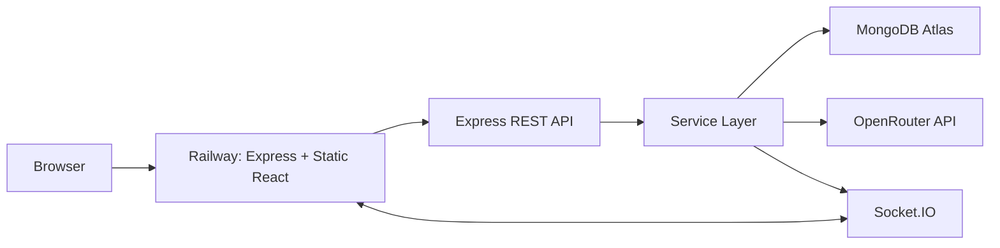

# WorkOS - AI-Assisted Team Task Manager

Production-oriented full-stack SaaS task manager for teams. WorkOS combines deterministic project/task management with selective AI assistance for planning, summaries, suggestions, and project-state chat.

## Demo Admin Access

Use this account for project review/demo only.

| Field | Value |
|---|---|
| Live App | https://workos-production-0d1c.up.railway.app/ |
| Role | Admin |
| Email | demo.admin@workos.com |
| Password | Demo@12345 |

Note: This is a public demo account created only so reviewers can access the admin dashboard, assign roles, create projects, and test the complete WorkOS flow.

## Project Snapshot

| Item | Details |
|---|---|
| Product | WorkOS - AI-Assisted Team Task Manager |
| Live App | https://workos-production-0d1c.up.railway.app/ |
| Health Check | https://workos-production-0d1c.up.railway.app/health |
| Repository | https://github.com/ashwanibaghel/WorkOS |
| Frontend | React, Vite, Socket.IO Client, `@hello-pangea/dnd`, Lucide icons |
| Backend | Node.js, Express, Socket.IO, JWT, Zod, Helmet, rate limiting |
| Database | MongoDB Atlas with Mongoose schemas and indexes |
| AI Provider | OpenRouter Chat Completions API |
| Deployment | Single Railway service serving both Express API and Vite build |
| Architecture | Controller -> Service -> Model with middleware-based auth, validation, and RBAC |

## Why This Project Matters

| Engineering Area | What It Demonstrates |
|---|---|
| Backend design | Thin controllers, reusable services, Mongoose models, centralized error handling. |
| Security | JWT auth, bcrypt password hashing, email verification tokens, Google login, RBAC, validation, no committed secrets. |
| Real-time architecture | Socket.IO project rooms for tasks and team chat, plus user notification rooms. |
| Product thinking | Admin, manager, and member dashboards are role-specific instead of one shared generic screen. |
| AI boundary | AI is advisory only; deterministic backend logic owns permissions, writes, metrics, and state transitions. |
| Deployment readiness | Root Railway config supports a monorepo build and serves the frontend from the backend in production. |
| Documentation | SRC, HLD, and LLD documents explain requirements, architecture, APIs, schemas, and flows. |

## Feature Matrix

| Area | Capability | Status | Main Files |
|---|---|---:|---|
| Authentication | Signup, login, email verification, Google Identity login, JWT session, current user | Done | `backend/src/services/authService.js`, `frontend/src/pages/Login.jsx` |
| Password policy | Minimum 8 chars, uppercase, number, special character, confirm password | Done | `backend/src/validators/schemas.js`, `frontend/src/pages/Login.jsx` |
| Role model | First user becomes admin, later users default to member, admin can update roles | Done | `backend/src/services/authService.js`, `backend/src/services/userService.js` |
| RBAC | Admin, manager, member permissions with middleware and service rules | Done | `backend/src/middlewares/rbac.js`, `backend/src/services/taskService.js` |
| Projects | Rich project creation with category, priority, status, delivery mode, lead, dates, goals, success criteria, tags | Done | `backend/src/models/Project.js`, `frontend/src/pages/Projects.jsx` |
| Team management | Admin/manager can add/remove users; managers can add only member users | Done | `backend/src/services/projectService.js`, `frontend/src/components/MemberManager.jsx` |
| Tasks | Create, assign, move status, submit for manager review, approve Done, due dates, completion timestamp | Done | `backend/src/services/taskService.js`, `frontend/src/components/TaskForm.jsx` |
| Kanban | Todo, In Progress, Review, Done; members submit review, managers approve | Done | `frontend/src/components/KanbanBoard.jsx` |
| Project workspace | Simple project flow, finish/reopen action, delete action, team chat, activity, AI panel | Done | `frontend/src/pages/ProjectDetail.jsx`, `frontend/src/components/ProjectChat.jsx` |
| Dashboards | Separate admin, manager, and member dashboards with different layouts | Done | `frontend/src/components/dashboard/*` |
| Analytics | Completion rate, pending, overdue, average completion time, workload, risk signals | Done | `backend/src/services/dashboardService.js` |
| Notifications | Assignment and overdue notifications with unread count | Done | `backend/src/services/notificationService.js` |
| Real-time | Task updates, team chat, and notification push through Socket.IO | Done | `backend/src/socket/socket.js`, `frontend/src/api/socket.js` |
| Activity logs | Project, task, member, chat, and AI actions logged | Done | `backend/src/services/activityService.js` |
| AI breakdown | Natural language goal to structured subtasks | Done | `backend/src/services/aiService.js` |
| AI description | Task title to description, steps, edge cases, acceptance criteria | Done | `frontend/src/components/TaskForm.jsx` |
| AI suggestions | Context-aware missing task suggestions | Done | `frontend/src/components/AiPanel.jsx` |
| AI chat | Project and dashboard AI assistant using current state | Done | `backend/src/controllers/aiController.js` |
| AI task review | Manager can ask AI to review a submitted task and suggest approve/change/manual review | Done | `backend/src/services/aiService.js`, `frontend/src/components/KanbanBoard.jsx` |
| AI summary | Human-readable progress, delays, risks, next steps | Done | `backend/src/services/aiService.js` |

## Documentation Pack

| Document | Purpose |
|---|---|
| [SRC - Software Requirements and Context](docs/SRC.md) | Product scope, user roles, requirements, success criteria, deployment context. |
| [HLD - High-Level Design](docs/HLD.md) | System architecture, component boundaries, deployment topology, security, scalability. |
| [LLD - Low-Level Design](docs/LLD.md) | Schemas, services, routes, validation, frontend components, socket events, flows. |

## Architecture Overview



| Layer | Responsibility |
|---|---|
| React frontend | Routes, forms, dashboards, Kanban UI, AI panel, auth state, socket client. |
| Express routes | Endpoint declaration and middleware composition. |
| Controllers | Request/response orchestration only. |
| Services | Business rules, database orchestration, AI boundary, audit logging, notifications. |
| Models | Mongoose schemas, validation constraints, relationships, indexes. |
| Socket.IO | Project-scoped task/chat events and user-scoped notification events. |
| OpenRouter | Structured AI output for planning and summaries. |

## Deterministic Logic vs AI Logic

| Deterministic Backend Logic | AI-Assisted Reasoning |
|---|---|
| Authentication, password hashing, JWT verification | Task breakdown from natural language. |
| Email verification token generation and validation | Detailed task description generation. |
| Role-based authorization and project access checks | Context-aware missing task suggestions. |
| Project/team/task CRUD, project team chat, and status updates | Project-state chat assistant. |
| Dashboard metrics and risk counts | Human-readable project summary. |
| Notifications, overdue scans, activity logs | Advisory next-step recommendations. |

AI never writes directly to MongoDB. AI can suggest tasks; creation still happens through normal task APIs and RBAC rules.

## Repository Structure

```txt
WorkOS/
  backend/
    src/
      config/          # env, MongoDB, OpenRouter
      controllers/     # thin HTTP handlers
      middlewares/     # auth, RBAC, validation, errors
      models/          # Mongoose schemas
      routes/          # Express route modules
      services/        # business logic and AI boundary
      socket/          # Socket.IO room/event helpers
      utils/           # AppError, asyncHandler
      validators/      # Zod schemas
      app.js           # Express app and production static frontend
      server.js        # HTTP server, socket server, DB connection
  frontend/
    src/
      api/             # Axios and Socket.IO clients
      components/      # Layout, Kanban, task form, AI panel, dashboards
      pages/           # Landing, auth, dashboard, projects, project detail
      state/           # Auth context
  docs/
    SRC.md
    HLD.md
    LLD.md
  railway.json         # root monorepo deployment config
```

## Role Permission Summary

| Capability | Admin | Manager | Member |
|---|---:|---:|---:|
| View dashboard | Yes | Yes | Yes |
| View accessible projects | All projects | Created/member projects | Member projects |
| Create projects | Yes | Yes | No |
| Change project lead | Yes | No | No |
| Finish/reopen projects | Yes | Yes, with access | No |
| Delete projects | Yes | Yes, with access | No |
| Add project members | Admin/manager/member except admin assignment limits handled by service | Member users only | No |
| Remove project members | Yes | Member users only | No |
| Create/assign/delete tasks | Yes | Yes, assignee must be member | No |
| Move any project task | Yes | Yes | No |
| Submit assigned task for review | Yes | Yes | Yes |
| Approve task as Done | Yes | Yes | No |
| Use project team chat | Yes | Yes | Yes, with project access |
| Update user roles | Yes | No | No |
| Use AI assistant | Yes | Yes | Yes |

## API Summary

| Method | Endpoint | Auth | Roles | Purpose |
|---|---|---:|---|---|
| POST | `/api/auth/signup` | No | Public | Create local account and send/return verification flow. |
| POST | `/api/auth/login` | No | Public | Login verified local user and issue JWT. |
| GET | `/api/auth/verify-email/:token` | No | Public | Verify email token and issue JWT. |
| POST | `/api/auth/resend-verification` | No | Public | Send another verification email for unverified users. |
| POST | `/api/auth/google` | No | Public | Verify Google ID token and issue JWT. |
| GET | `/api/auth/me` | Yes | All | Get current user. |
| GET | `/api/projects` | Yes | All | List accessible projects. |
| POST | `/api/projects` | Yes | Admin, Manager | Create project. |
| GET | `/api/projects/:projectId` | Yes | All with project access | Get project detail. |
| PATCH | `/api/projects/:projectId` | Yes | Admin, Manager | Update project. |
| DELETE | `/api/projects/:projectId` | Yes | Admin, Manager | Delete project, tasks, and project chat messages. |
| GET | `/api/projects/:projectId/activity` | Yes | All with project access | Get project activity. |
| GET | `/api/projects/:projectId/messages` | Yes | All with project access | List latest project team chat messages. |
| POST | `/api/projects/:projectId/messages` | Yes | All with project access | Send project team chat message. |
| POST | `/api/projects/:projectId/members/:memberId` | Yes | Admin, Manager | Add project member. |
| DELETE | `/api/projects/:projectId/members/:memberId` | Yes | Admin, Manager | Remove project member. |
| GET | `/api/tasks/project/:projectId` | Yes | All with project access | List project tasks. |
| POST | `/api/tasks` | Yes | Admin, Manager | Create task. |
| PATCH | `/api/tasks/:taskId` | Yes | All with restrictions | Update task; members status-only for assigned tasks. |
| DELETE | `/api/tasks/:taskId` | Yes | Admin, Manager | Delete task. |
| GET | `/api/dashboard` | Yes | All | Role-aware analytics overview. |
| GET | `/api/notifications` | Yes | All | List notifications. |
| PATCH | `/api/notifications/:notificationId/read` | Yes | All | Mark notification read. |
| GET | `/api/users` | Yes | Admin, Manager | List users for team assignment. |
| PATCH | `/api/users/:userId/role` | Yes | Admin | Update role. |
| GET | `/health` | No | Public | Railway health check. |

## AI API Summary

| Method | Endpoint | Input | Output |
|---|---|---|---|
| POST | `/api/ai/breakdown` | `goal`, optional `projectId` | `tasks[]` with title, description, priority, estimatedHours, acceptanceCriteria. |
| POST | `/api/ai/description` | `title`, optional `projectId` | description, steps, edge cases, acceptance criteria. |
| POST | `/api/ai/dashboard/chat` | `question` | Dashboard-context answer, actions, risks. |
| POST | `/api/ai/tasks/:taskId/review` | task id | AI review recommendation for manager approval. |
| GET | `/api/ai/projects/:projectId/suggestions` | project id | Suggested missing tasks. |
| POST | `/api/ai/projects/:projectId/chat` | project id, question | Project-context answer, recommended actions, risks. |
| GET | `/api/ai/projects/:projectId/summary` | project id | Summary, progress, delays, risks, next steps. |

## Local Setup

### Prerequisites

| Tool | Recommended |
|---|---|
| Node.js | 20+ |
| npm | 10+ |
| MongoDB | MongoDB Atlas or local MongoDB |
| OpenRouter API key | Required for AI endpoints |
| Google OAuth client id | Required for Google login |
| SMTP provider | Required for production local-email signup verification |

### Install

```bash
npm run install:all
```

### Backend Environment

Create `backend/.env` from `backend/.env.example`.

| Variable | Required | Purpose |
|---|---:|---|
| `NODE_ENV` | No | `development` or `production`. |
| `PORT` | No | Server port; Railway injects this automatically. |
| `CLIENT_URL` | Production recommended | Public frontend URL for CORS and email verification links. |
| `MONGO_URI` | Yes | MongoDB Atlas connection string. |
| `JWT_SECRET` | Yes | Long random JWT signing secret. |
| `JWT_EXPIRES_IN` | No | JWT lifetime, default `7d`. |
| `GOOGLE_CLIENT_ID` | Google login | Backend verifies Google token audience. |
| `SMTP_HOST`, `SMTP_USER`, `SMTP_PASS` | Production local signup | Verification email provider config. |
| `SMTP_PORT`, `SMTP_SECURE`, `MAIL_FROM` | Email | Email transport details. |
| `OPENROUTER_API_KEY` | AI | Enables AI endpoints. |
| `OPENROUTER_MODEL` | No | Defaults to `openrouter/free`. |
| `OPENROUTER_REFERER`, `OPENROUTER_TITLE` | No | OpenRouter attribution metadata. |

In development, if SMTP is not configured, the backend logs and returns a development verification link. In production, SMTP is required for local email verification; Google login auto-verifies the email from Google.

### Frontend Environment

Create `frontend/.env` from `frontend/.env.example`.

| Variable | Required | Purpose |
|---|---:|---|
| `VITE_GOOGLE_CLIENT_ID` | Google login | Google Identity client id for the frontend button. |
| `VITE_API_URL` | Local only | Defaults to `http://localhost:5000/api` in dev and `/api` in production. |
| `VITE_SOCKET_URL` | Local only | Defaults to `http://localhost:5000` in dev and same-origin in production. |

### Run Locally

| Command | Purpose |
|---|---|
| `npm run dev` | Run backend and frontend together. |
| `npm run dev --prefix backend` | Run backend only. |
| `npm run dev --prefix frontend` | Run frontend only. |
| `npm run build --prefix frontend` | Build frontend. |
| `npm start --prefix backend` | Start backend. |

Default URLs:

| App | URL |
|---|---|
| Frontend | `http://localhost:5173` |
| Backend | `http://localhost:5000` |
| Health | `http://localhost:5000/health` |

## Railway Deployment

This repository is configured for a single Railway service from the repository root.

| File | Purpose |
|---|---|
| `railway.json` | Runs `npm run install:all && npm run build`, starts `npm start`, checks `/health`. |
| `backend/src/app.js` | Serves `frontend/dist` when `NODE_ENV=production`. |
| `frontend/src/api/client.js` | Uses `/api` in production when no `VITE_API_URL` is set. |
| `frontend/src/api/socket.js` | Uses same-origin Socket.IO in production when no `VITE_SOCKET_URL` is set. |

### Railway Variables

Set these in Railway:

```env
NODE_ENV=production
MONGO_URI=your_mongodb_atlas_uri
JWT_SECRET=long_random_secret
GOOGLE_CLIENT_ID=your_google_client_id
VITE_GOOGLE_CLIENT_ID=your_google_client_id
OPENROUTER_API_KEY=your_openrouter_key
OPENROUTER_MODEL=openrouter/free
CLIENT_URL=https://workos-production-0d1c.up.railway.app
OPENROUTER_REFERER=https://workos-production-0d1c.up.railway.app
OPENROUTER_TITLE=WorkOS
```

Do not set `VITE_API_URL=http://localhost:5000/api` or `VITE_SOCKET_URL=http://localhost:5000` in Railway. The deployed frontend and backend run on the same Railway domain.

### Google Cloud Configuration

Add this to the Google OAuth client:

| Setting | Value |
|---|---|
| Authorized JavaScript origin | `https://workos-production-0d1c.up.railway.app` |

The current implementation uses Google Identity Services credential/ID-token verification. The backend verifies the token audience with `GOOGLE_CLIENT_ID` and issues the app JWT.

## Sample API Requests

Use the deployed API:

```bash
API="https://workos-production-0d1c.up.railway.app/api"
TOKEN="paste-jwt-token-here"
```

Signup:

```bash
curl -X POST "$API/auth/signup" \
  -H "Content-Type: application/json" \
  -d '{"name":"Asha Manager","email":"asha@example.com","password":"Password123!","passwordConfirm":"Password123!"}'
```

Verify email:

```bash
curl "$API/auth/verify-email/VERIFICATION_TOKEN"
```

Login:

```bash
curl -X POST "$API/auth/login" \
  -H "Content-Type: application/json" \
  -d '{"email":"asha@example.com","password":"Password123!"}'
```

Create project:

```bash
curl -X POST "$API/projects" \
  -H "Authorization: Bearer $TOKEN" \
  -H "Content-Type: application/json" \
  -d '{
    "name":"Authentication System Upgrade",
    "description":"Build secure signup, login, Google auth, email verification, and RBAC.",
    "category":"engineering",
    "priority":"high",
    "deliveryMode":"sprint",
    "dueDate":"2026-05-20",
    "goals":["Implement secure signup and login","Add Google OAuth authentication","Protect routes using JWT and RBAC"],
    "successCriteria":["Users cannot login before email verification","Managers and members see role-specific dashboards","JWT-protected APIs reject unauthorized users"],
    "tags":["auth","security","sprint"]
  }'
```

Create task:

```bash
curl -X POST "$API/tasks" \
  -H "Authorization: Bearer $TOKEN" \
  -H "Content-Type: application/json" \
  -d '{"projectId":"PROJECT_ID","title":"Login and JWT issuance","description":"Implement verified login with JWT session issuance.","assignedTo":null,"status":"todo","dueDate":"2026-05-15"}'
```

Move task:

```bash
curl -X PATCH "$API/tasks/TASK_ID" \
  -H "Authorization: Bearer $TOKEN" \
  -H "Content-Type: application/json" \
  -d '{"status":"in-progress"}'
```

Finish project:

```bash
curl -X PATCH "$API/projects/PROJECT_ID" \
  -H "Authorization: Bearer $TOKEN" \
  -H "Content-Type: application/json" \
  -d '{"status":"completed"}'
```

Send project chat message:

```bash
curl -X POST "$API/projects/PROJECT_ID/messages" \
  -H "Authorization: Bearer $TOKEN" \
  -H "Content-Type: application/json" \
  -d '{"message":"Auth API is ready for review. Please test Google login next."}'
```

AI task breakdown:

```bash
curl -X POST "$API/ai/breakdown" \
  -H "Authorization: Bearer $TOKEN" \
  -H "Content-Type: application/json" \
  -d '{"projectId":"PROJECT_ID","goal":"Build authentication system with JWT and role-based access"}'
```

AI project summary:

```bash
curl -X GET "$API/ai/projects/PROJECT_ID/summary" \
  -H "Authorization: Bearer $TOKEN"
```

## Quality Checklist

| Quality Area | Status |
|---|---:|
| Layered backend architecture | Done |
| JWT authentication | Done |
| Password hashing | Done |
| Email verification | Done |
| Google Identity login | Done |
| Middleware-based RBAC | Done |
| Service-level permission enforcement | Done |
| Zod validation | Done |
| Centralized error handling | Done |
| MongoDB schemas and indexes | Done |
| Real-time task updates | Done |
| Real-time project team chat | Done |
| Real-time notifications | Done |
| Activity logs | Done |
| Role-specific dashboards | Done |
| Productivity analytics | Done |
| AI service isolation | Done |
| Structured AI output | Done |
| Railway monorepo deployment | Done |
| HLD, LLD, SRC docs | Done |

## Reviewer Notes

| Topic | Explanation |
|---|---|
| The first account becomes admin | This makes local/demo setup simple without seed scripts. |
| Later signups default to member | Users cannot self-promote; admin updates roles. |
| Managers are constrained | Managers can create projects and assign work, but cannot add elevated users as normal team members. |
| Project finish is explicit | Completed projects are locked for task/team changes until an admin or manager reopens them. |
| AI is advisory | It produces structured planning output but does not bypass RBAC or mutate the database directly. |
| Single Railway service | The backend serves the static frontend in production; frontend API and socket calls are same-origin. |
