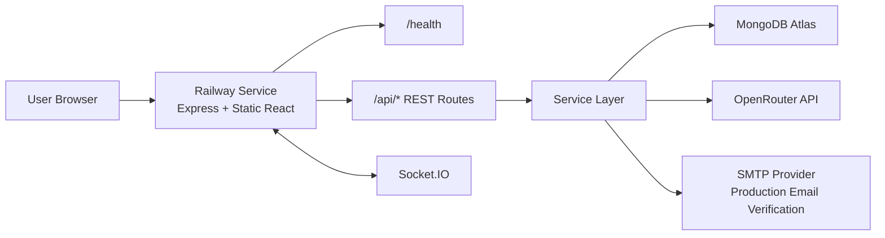
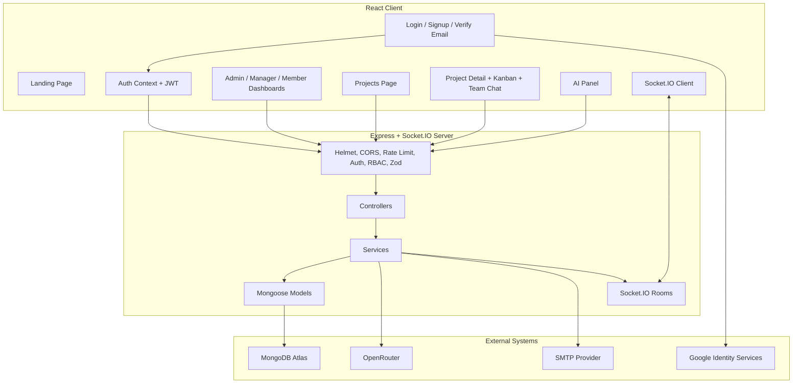
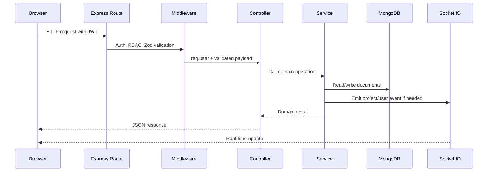
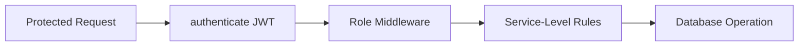
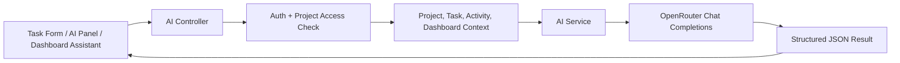
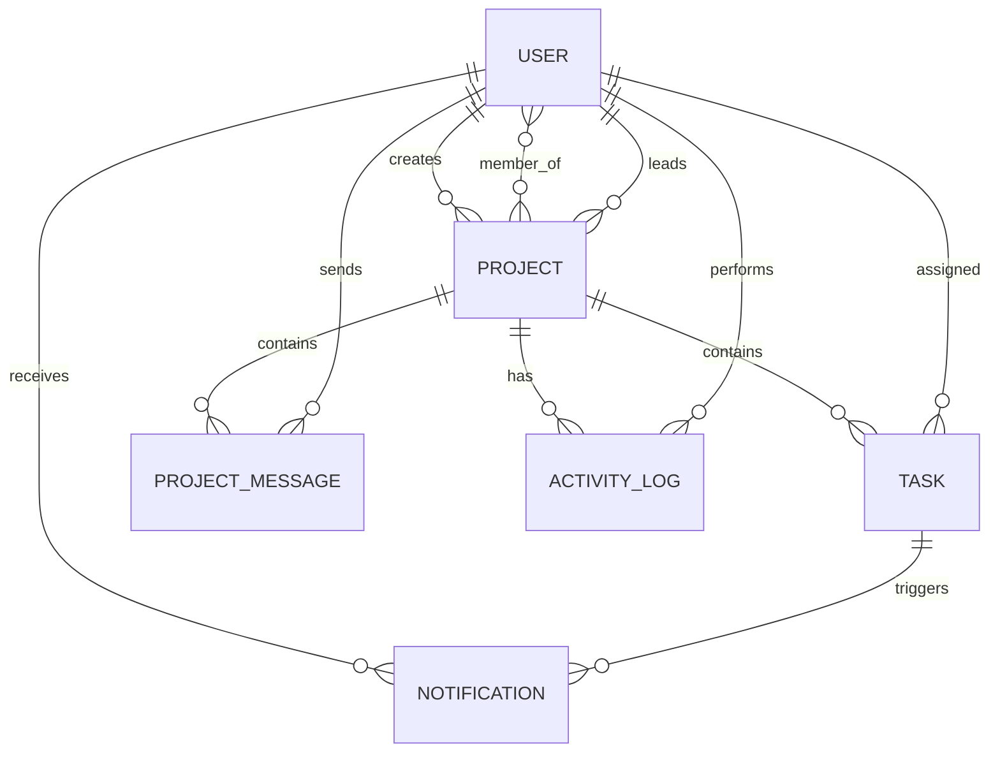

# WorkOS High-Level Design

## Document Control

| Field | Value |
|---|---|
| Project | WorkOS - AI-Assisted Team Task Manager |
| Document | High-Level Design (HLD) |
| Version | 2.1 |
| Last Updated | May 7, 2026 |
| Live App | https://workos-production-0d1c.up.railway.app/ |
| Repository | https://github.com/ashwanibaghel/WorkOS |

## 1. Purpose

This HLD explains the system-level architecture of WorkOS: major components, boundaries, deployment topology, request flow, security model, RBAC strategy, real-time communication, data design, AI integration, and scalability considerations.

WorkOS is designed as a production-style SaaS task manager, not a basic CRUD app. The system separates deterministic backend decisions from AI-assisted reasoning so the product remains secure, explainable, and maintainable.

## 2. System Overview

| Layer | Technology | Responsibility |
|---|---|---|
| Browser Client | React, Vite, React Router, Socket.IO Client | UI, auth state, role dashboards, project/task views, Kanban, project team chat, AI interactions. |
| API Runtime | Node.js, Express | REST API, validation, auth, RBAC, CORS, rate limiting, error handling. |
| Business Layer | Service modules | Project/task/project-chat/user/notification/activity/analytics/AI orchestration. |
| Persistence | MongoDB Atlas, Mongoose | Durable storage, relationships, indexes, schema constraints. |
| Real-time | Socket.IO | Project task events, project chat events, and user notification events. |
| AI Provider | OpenRouter Chat Completions API | Structured reasoning outputs for planning and summaries. |
| Hosting | Railway | Single service builds frontend and serves it through Express in production. |

## 3. Deployment Architecture

| Concern | Current Implementation |
|---|---|
| Public URL | `https://workos-production-0d1c.up.railway.app/` |
| Health check | `GET /health` |
| Frontend hosting | `backend/src/app.js` serves `frontend/dist` when `NODE_ENV=production`. |
| API base in production | Frontend defaults to `/api`. |
| Socket URL in production | Frontend defaults to `window.location.origin`. |
| Build command | `npm run install:all && npm run build` from root `railway.json`. |
| Start command | `npm start` from root, which starts backend. |

## 4. Component Diagram

## 5. Backend Layering

| Layer | Example | Responsibility |
|---|---|---|
| Route | `backend/src/routes/taskRoutes.js` | Define endpoint, method, middleware chain. |
| Middleware | `authenticate`, `canManage`, `validate` | Authenticate, authorize, validate request data. |
| Controller | `taskController.create` | Call service and shape HTTP response. |
| Service | `taskService.create` | Enforce business rules, write DB, log activity, emit events. |
| Model | `Task` | Schema constraints, references, indexes. |

Controllers are intentionally thin. Business decisions live in services so they can be reused by REST routes, background jobs, or future API surfaces.

## 6. Request Lifecycle

## 7. Authentication Architecture

| Feature | Design |
|---|---|
| Local signup | User provides name, email, password, password confirmation. |
| Password policy | Minimum 8 characters, one uppercase, one number, one special character. |
| Password storage | bcrypt hash in `User` model pre-save hook. |
| Email verification | SHA-256 hashed verification token stored with 24-hour expiry. |
| Development email fallback | If SMTP is missing in development, verification URL is logged/returned. |
| Production email rule | If SMTP is missing in production, local signup verification fails with 503. |
| Google login | Frontend receives Google credential; backend verifies ID token audience using `GOOGLE_CLIENT_ID`. |
| OAuth users | Google users are auto email-verified. |
| JWT | Signed with `JWT_SECRET`; contains user id and role. |
| First user bootstrap | First registered user becomes admin; later users default to member. |

## 8. Authorization and RBAC

| Role | System Responsibility | Key Restrictions |
|---|---|---|
| Admin | System-wide oversight and user role management. | Cannot change own role through role update endpoint. |
| Manager | Project execution, team assignment, task creation. | Can add/assign member users only; cannot change project lead to another user. |
| Member | Focused task execution. | Can update only status of assigned tasks; cannot create tasks or manage teams. |

| Capability | Admin | Manager | Member |
|---|---:|---:|---:|
| View all projects | Yes | No | No |
| View accessible projects | Yes | Yes | Yes |
| Create project | Yes | Yes | No |
| Change project lead | Yes | No | No |
| Finish/reopen project | Yes | Yes, with access | No |
| Delete project | Yes | Yes, with access | No |
| Add/remove project members | Yes | Member users only | No |
| Create/assign/delete tasks | Yes | Yes | No |
| Update task status | Yes | Yes | Assigned task only |
| Use project team chat | Yes | Yes | Yes, with access |
| Update user roles | Yes | No | No |
| Use AI assistant | Yes | Yes | Yes |

## 9. Role-Based Dashboards

| Dashboard | Purpose | Key UI/UX |
|---|---|---|
| Admin Dashboard | System control and global insight. | Total projects, users, overdue tasks, efficiency, AI insights, risk alerts, charts, user role controls. |
| Manager Dashboard | Team delivery and execution. | Workload visualization, due-this-week list, notifications, AI suggestions, interactive Kanban. |
| Member Dashboard | Focus and productivity. | Next best task, personal task queue, overdue alerts, productivity stats, AI nudges. |

Each dashboard receives the same `/api/dashboard` overview payload but renders different components and workflows based on role.

## 10. Real-Time Architecture

| Event | Room | Produced By | Consumed By |
|---|---|---|---|
| `task:created` | `project:{projectId}` | `taskService.create` | Project detail page Kanban board. |
| `task:updated` | `project:{projectId}` | `taskService.update` | Project detail page Kanban board. |
| `task:deleted` | `project:{projectId}` | `taskService.remove` | Project detail page Kanban board. |
| `chat:message` | `project:{projectId}` | `projectChatService.create` | Project detail team chat panel. |
| `notification:new` | `user:{userId}` | `notificationService` | Layout notification dropdown. |

Socket connections include JWT in the handshake when available. Authenticated sockets automatically join their user room for notifications. Project detail pages join and leave project rooms explicitly.

## 11. AI Integration Architecture

| AI Feature | Deterministic Boundary |
|---|---|
| Task breakdown | AI returns candidate tasks; actual task creation uses `POST /api/tasks`. |
| Description generator | AI drafts text; user/manager decides whether to save it. |
| Suggestions | AI proposes missing work; no automatic database writes. |
| Project chat | AI answers from authorized project context only. |
| Dashboard chat | AI answers from role-scoped dashboard overview only. |
| Summary | AI converts deterministic state into human-readable progress/risk language. |

AI output is requested as structured JSON. The AI service first tries strict JSON schema mode and falls back to JSON-only prompting for models that do not support strict parameters.

## 12. Data Model Overview

| Model | Purpose |
|---|---|
| User | Auth identity, role, local/Google provider details, email verification state. |
| Project | Workspace with metadata, lead, members, goals, success criteria, tags. |
| Task | Assignable work item with status, due date, completion timestamp. |
| ProjectMessage | Project-level manager/member discussion stored for team context. |
| ActivityLog | Audit trail for project/task/member/chat/AI events. |
| Notification | User-facing alerts for assignment and overdue work. |

## 13. Security Architecture

| Area | Control |
|---|---|
| Secrets | Runtime env vars; `.env` ignored; `.env.example` only placeholders. |
| HTTP hardening | Helmet with CSP adjusted for Google Identity and Socket.IO. |
| CORS | Allowed origins from `CLIENT_URL`, Railway public domain, and localhost dev URLs. |
| Rate limiting | Global Express rate limit. |
| Passwords | bcrypt hashing; password excluded from default queries. |
| Email verification | Hashed token at rest; token expiry enforced. |
| Authorization | Middleware and service-level checks. |
| Input validation | Zod body/params validation before controllers. |
| Errors | Centralized production-safe error middleware. |

## 14. Scalability Considerations

| Concern | Current Design | Future Upgrade |
|---|---|---|
| API horizontal scaling | JWT stateless API. | Multiple Railway replicas behind load balancer. |
| Socket.IO scaling | In-memory rooms in single service. | Redis adapter and sticky sessions. |
| Overdue scan | In-process hourly interval. | Railway cron, BullMQ, or managed scheduler. |
| Mongo queries | Indexes on project, members, task status, due date, project messages, activity logs. | Query-plan-based compound indexes. |
| AI latency | Synchronous endpoint calls. | Async job queue for long-running summaries. |
| Email delivery | SMTP provider through Nodemailer. | Provider abstraction for SES/SendGrid templates. |
| Audit growth | ActivityLog collection. | Archival policy and TTL/cold storage if needed. |

## 15. Observability and Auditability

| Capability | Implementation |
|---|---|
| Request logging | Morgan. |
| Health endpoint | `/health` for Railway and manual checks. |
| Domain audit | `ActivityLog` for project, task, member, chat, AI events. |
| User alerts | `Notification` collection plus real-time socket event. |
| Error consistency | `AppError` and centralized error middleware. |

## 16. Key Design Decisions

| Decision | Reason |
|---|---|
| Single Railway service | Simplifies demo deployment: one public URL serves frontend, API, and sockets. |
| Layered backend | Keeps code readable and interview-friendly. |
| Services own business rules | Prevents controllers from becoming business-logic containers. |
| AI is isolated in `aiService` | Makes the AI boundary reviewable and replaceable. |
| First user admin | Removes the need for seed scripts during demo setup. |
| Managers can add only members | Prevents one manager from elevating access by adding another privileged user. |
| Completed projects lock execution changes | Finish means the workspace is closed for task/team mutation until it is reopened. |
| Frontend production API is same-origin | Avoids hardcoded deployed URLs and localhost mistakes on Railway. |
