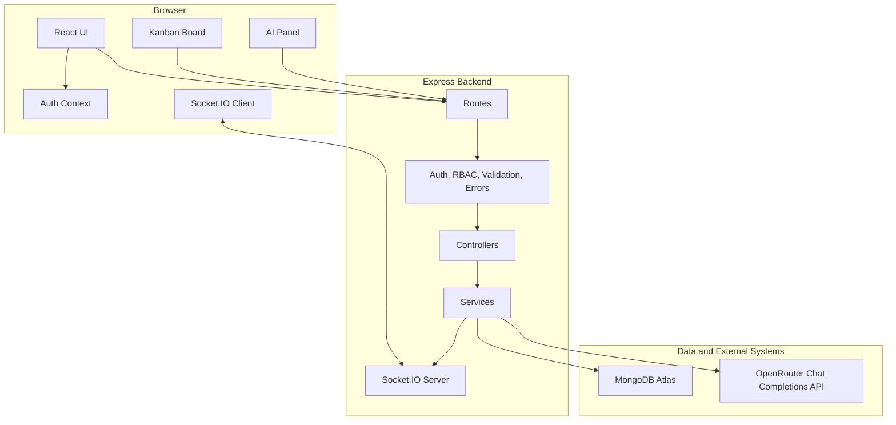
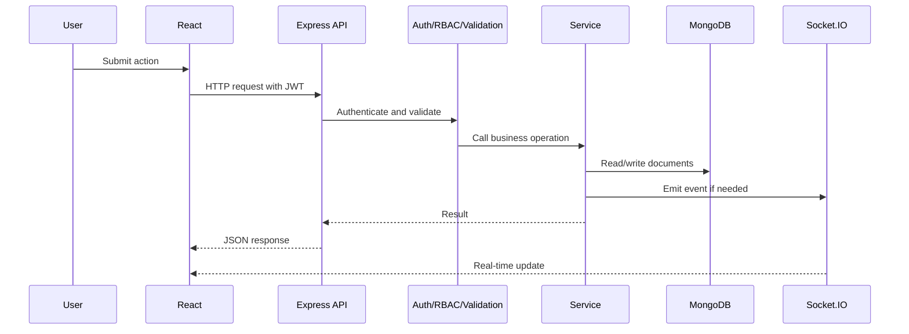
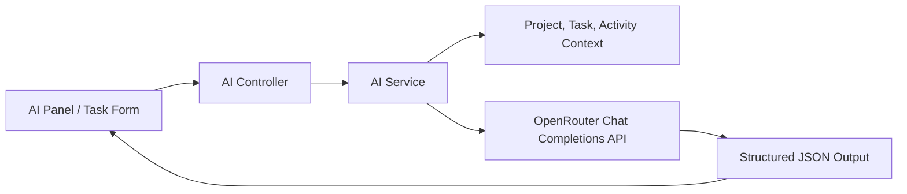
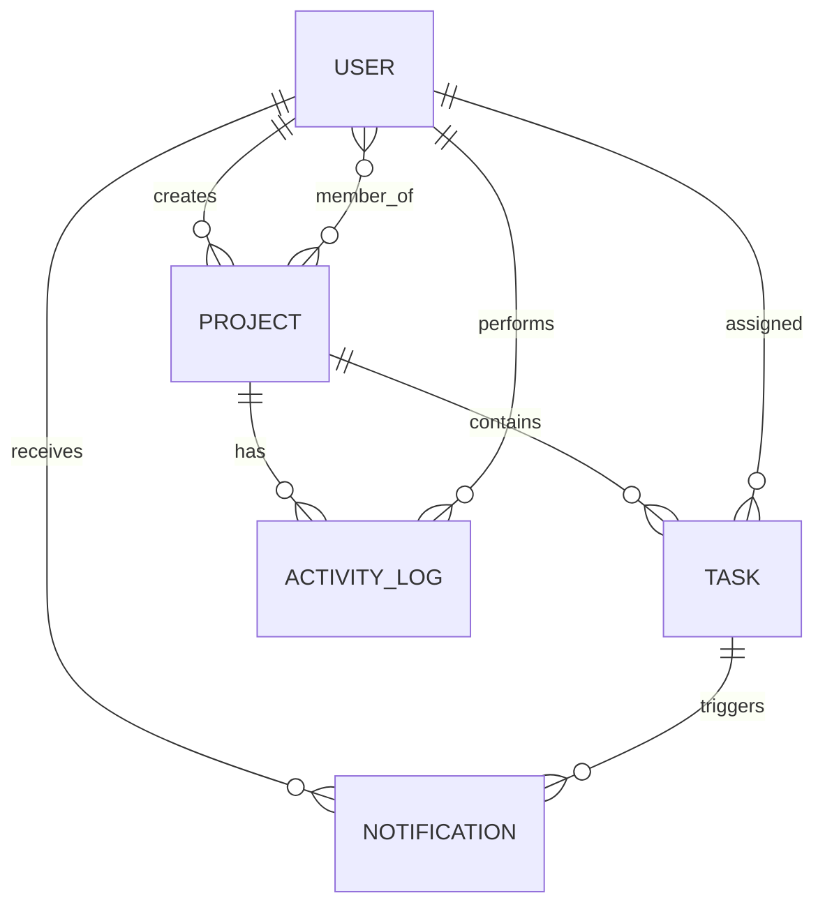
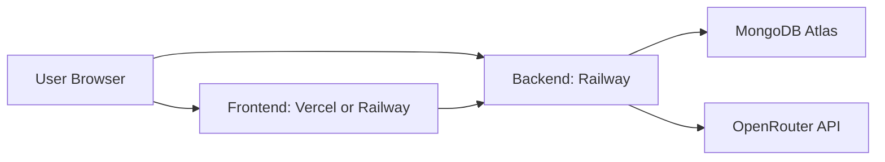

# WorkOS High-Level Design

## 1. Purpose

This document describes the high-level architecture of WorkOS, an AI-assisted team task management platform. It focuses on system boundaries, major components, deployment topology, data flow, real-time communication, security, scalability, and AI integration strategy.

## 2. Architecture Overview

| Layer | Technology | Responsibility |
|---|---|---|
| Client | React, Vite | UI, routing, forms, Kanban interactions, API calls, socket subscriptions. |
| API | Node.js, Express | REST endpoints, authentication, validation, RBAC, orchestration. |
| Business Logic | Service modules | Project, task, notification, audit, analytics, and AI workflows. |
| Persistence | MongoDB, Mongoose | Durable storage, schema validation, indexes, relationships. |
| Real-time | Socket.IO | Task updates, assignment updates, notification push. |
| AI | OpenRouter Chat Completions API | Cost-controlled structured reasoning outputs for productivity assistance. |
| Deployment | Railway, Vercel/Railway, MongoDB Atlas | Cloud runtime, hosting, managed database. |

## 3. Component Diagram

## 4. Monorepo Structure

| Path | Purpose |
|---|---|
| `backend/src/app.js` | Express app setup, middleware, routes, error handling. |
| `backend/src/server.js` | HTTP server, Socket.IO bootstrapping, DB connection, overdue scan. |
| `backend/src/controllers` | Thin HTTP layer. |
| `backend/src/services` | Business logic and orchestration. |
| `backend/src/models` | Mongoose schemas and indexes. |
| `backend/src/middlewares` | Authentication, authorization, validation, error handling. |
| `backend/src/socket` | Socket room joins and event emit helpers. |
| `frontend/src/pages` | Route-level views. |
| `frontend/src/components` | Reusable UI components. |
| `frontend/src/api` | Axios and Socket.IO clients. |
| `frontend/src/state` | Auth context and session state. |
| `docs` | Architecture and requirements documentation. |

## 5. Request Lifecycle

## 6. Authentication and Authorization

| Concern | Design |
|---|---|
| Identity | JWT contains user id and role. |
| Password storage | bcrypt hash through Mongoose pre-save hook. |
| Google OAuth | Frontend receives Google ID token; backend verifies token audience with Google client id and then issues app JWT. |
| Protected routes | `authenticate` middleware validates token and attaches `req.user`. |
| Role checks | `authorize` and `canManage` middleware guard manager/admin operations. |
| Member rule | Service layer enforces that members update only assigned task status. |
| Socket auth | Socket handshake may include JWT; authenticated sockets join user notification rooms. |

## 7. Role Permission Matrix

| Feature | Admin | Manager | Member |
|---|---:|---:|---:|
| Signup/Login | Yes | Yes | Yes |
| Create project | Yes | Yes | No |
| View accessible projects | Yes | Yes | Yes |
| Update/delete project | Yes | Yes | No |
| Add/remove members | Yes | Yes | No |
| Create/assign/delete task | Yes | Yes | No |
| Update assigned task status | Yes | Yes | Yes |
| View dashboard | Yes | Yes | Yes |
| Use AI assistant | Yes | Yes | Yes |
| View activity logs | Yes | Yes | Yes |

## 8. Real-Time Design

| Event | Room | Producer | Consumer | Use |
|---|---|---|---|---|
| `task:created` | `project:{projectId}` | `taskService.create` | Project detail page | Add new task without refresh. |
| `task:updated` | `project:{projectId}` | `taskService.update` | Kanban board | Reflect status/assignment changes. |
| `task:deleted` | `project:{projectId}` | `taskService.remove` | Kanban board | Remove deleted task. |
| `notification:new` | `user:{userId}` | `notificationService` | Layout header | Show assignment/overdue alerts. |

## 9. AI Integration Architecture

### AI Boundary Rules

| Rule | Reason |
|---|---|
| AI never performs database writes directly. | Prevents uncontrolled state mutation. |
| AI receives minimal project context required for the feature. | Reduces prompt noise and exposure. |
| AI outputs structured JSON schemas. | Makes frontend rendering predictable. |
| Backend validates access before AI context is assembled. | Prevents unauthorized context leakage. |
| Deterministic metrics remain in backend analytics. | Keeps numbers explainable and reproducible. |

## 10. Data Model Overview

## 11. Deployment Architecture

| Service | Deployment Target | Notes |
|---|---|---|
| Frontend | Vercel or Railway | Static Vite build from `frontend/dist`. |
| Backend | Railway | Node.js Express server with Socket.IO. |
| Database | MongoDB Atlas | Connection via `MONGO_URI`. |
| AI Provider | OpenRouter | Access through `OPENROUTER_API_KEY`; default model is `openrouter/free`. |

## 12. Scalability Considerations

| Concern | Current Design | Future Upgrade |
|---|---|---|
| API scaling | Stateless JWT-based API can run multiple instances. | Add sticky sessions or Redis adapter for Socket.IO. |
| Socket.IO | In-memory rooms on one instance. | Use `@socket.io/redis-adapter` across multiple instances. |
| Database queries | Indexes on project/task/log fields. | Add compound indexes based on production query metrics. |
| Overdue scans | In-process interval. | Move to Railway cron, BullMQ, or external scheduler. |
| AI latency | Synchronous request-response. | Add async AI jobs for long summaries if needed. |
| Audit growth | Activity logs indexed by project/user/time. | Archive old logs to cold storage. |

## 13. Security Considerations

| Security Area | Current Control |
|---|---|
| Secrets | Loaded from environment variables. |
| Passwords | Hashed with bcrypt. |
| Auth | JWT bearer tokens. |
| Authorization | Middleware and service-level permission checks. |
| Input validation | Zod request schemas. |
| HTTP hardening | Helmet middleware. |
| Rate limiting | Express rate limit. |
| CORS | Restricted to configured frontend URL. |
| Error handling | Production-safe error responses. |

## 14. Observability and Auditability

| Capability | Implementation |
|---|---|
| Request logging | Morgan. |
| Domain audit trail | ActivityLog collection. |
| Error standardization | `AppError` and error middleware. |
| User notifications | Notification collection and socket events. |
| Project timeline | Project activity endpoint. |

## 15. Key Design Decisions

| Decision | Why It Matters |
|---|---|
| Layered backend | Makes code easier to test, review, and extend. |
| Services own business logic | Prevents controllers from becoming unmaintainable. |
| Zod validation | Gives explicit input contracts before service execution. |
| Structured AI output | Avoids fragile parsing of free-form AI text. |
| Socket rooms by project/user | Efficiently targets real-time events. |
| MongoDB with Mongoose | Flexible document model for task/project collaboration. |
