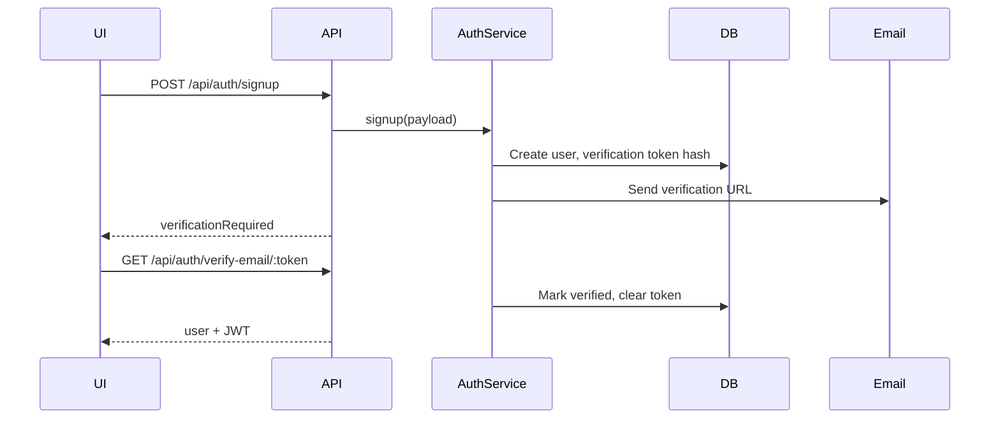
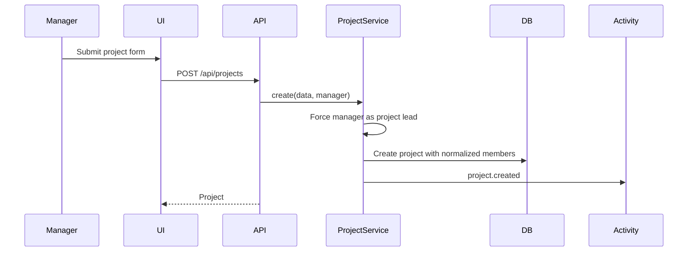
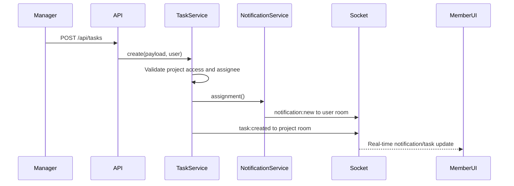
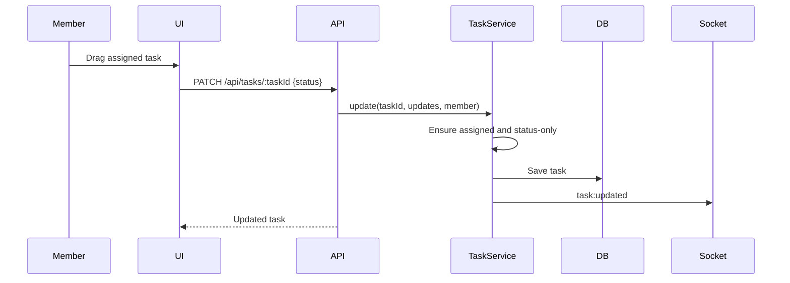
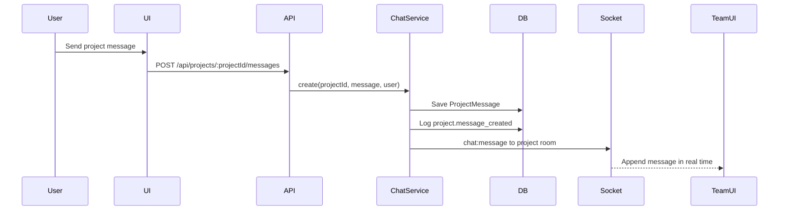
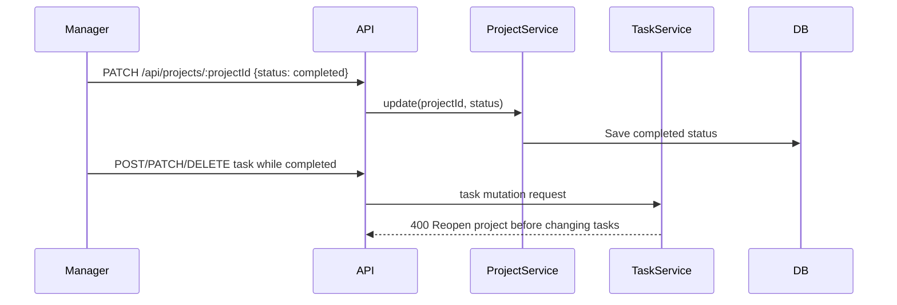
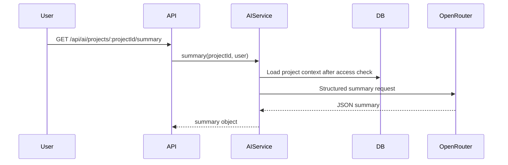

# WorkOS Low-Level Design

## Document Control

| Field | Value |
|---|---|
| Project | WorkOS - AI-Assisted Team Task Manager |
| Document | Low-Level Design (LLD) |
| Version | 2.1 |
| Last Updated | May 7, 2026 |
| Live App | https://workos-production-0d1c.up.railway.app/ |
| Repository | https://github.com/ashwanibaghel/WorkOS |

## 1. Purpose

This LLD describes WorkOS at implementation level: backend modules, schemas, services, API routes, validation contracts, frontend components, socket events, deployment behavior, project collaboration flows, and important request flows.

## 2. Backend Entry Points

| File | Responsibility |
|---|---|
| `backend/src/server.js` | Creates HTTP server, initializes Socket.IO, connects MongoDB, starts Express, schedules overdue scan. |
| `backend/src/app.js` | Configures Express middleware, routes, Helmet/CSP, CORS, static frontend serving, 404 and error middleware. |
| `backend/src/config/env.js` | Loads `.env`, validates required env vars, derives Railway public URL and client URLs. |
| `backend/src/config/db.js` | Connects Mongoose with `MONGO_URI`. |
| `backend/src/config/openrouter.js` | Creates the OpenRouter chat client if `OPENROUTER_API_KEY` exists. |

## 3. Express Middleware Design

| Middleware | File | Details |
|---|---|---|
| `helmet` | `app.js` | HTTP hardening with CSP allowing Google Identity, WebSockets, and images. |
| `cors` | `app.js` | Allows configured `CLIENT_URL`, Railway public domain, localhost dev URLs. |
| `express.json` | `app.js` | 1 MB JSON payload limit. |
| `rateLimit` | `app.js` | 300 requests per 15 minutes. |
| `morgan` | `app.js` | Request logs. |
| `authenticate` | `middlewares/auth.js` | Verifies bearer JWT and loads user. |
| `authorize` | `middlewares/rbac.js` | Requires one of the specified roles. |
| `canManage` | `middlewares/rbac.js` | Shortcut for admin/manager routes. |
| `validate` | `middlewares/validate.js` | Runs Zod schemas against body, params, query. |
| `notFound` | `middlewares/errorHandler.js` | Handles unknown API routes/static misses. |
| `errorHandler` | `middlewares/errorHandler.js` | Standardizes errors. |

## 4. Database Schemas

### 4.1 User

| Field | Type | Required | Notes |
|---|---|---:|---|
| `name` | String | Yes | 2-80 characters. |
| `email` | String | Yes | Unique, lowercase, trimmed. |
| `password` | String | Local users | bcrypt hashed, `select: false`. |
| `role` | Enum | Yes | `admin`, `manager`, `member`; default `member`. |
| `authProvider` | Enum | Yes | `local` or `google`; default `local`. |
| `googleId` | String | No | Unique sparse index, set for Google users. |
| `avatar` | String | No | Google profile picture. |
| `isEmailVerified` | Boolean | Yes | False for local signup until verification; true for Google login. |
| `emailVerifiedAt` | Date | No | Verification timestamp. |
| `emailVerificationTokenHash` | String | No | SHA-256 hash, `select: false`. |
| `emailVerificationExpiresAt` | Date | No | 24-hour expiry, `select: false`. |
| `createdAt`, `updatedAt` | Date | Auto | Mongoose timestamps. |

Model hooks/methods:

| Method | Responsibility |
|---|---|
| `pre("save")` | Hash password with bcrypt cost 12 when modified. |
| `comparePassword` | bcrypt compare for login. |
| `toJSON` | Removes password and verification token fields. |

### 4.2 Project

| Field | Type | Required | Notes |
|---|---|---:|---|
| `name` | String | Yes | 2-120 characters. |
| `description` | String | No | Up to 2000 chars. |
| `category` | Enum | Yes | `engineering`, `product`, `design`, `marketing`, `operations`, `research`, `client`, `other`. |
| `priority` | Enum | Yes | `low`, `medium`, `high`, `critical`. |
| `status` | Enum | Yes | `planning`, `active`, `on-hold`, `completed`. |
| `deliveryMode` | Enum | Yes | `kanban`, `sprint`, `milestone`. |
| `projectManager` | ObjectId(User) | No | Must be admin/manager if supplied by admin; manager-created projects use self. |
| `startDate` | Date | No | Optional planning metadata. |
| `dueDate` | Date | No | Used for delivery context and UI. |
| `goals` | String[] | No | Max 8, each max 240 chars. |
| `successCriteria` | String[] | No | Max 8, each max 240 chars. |
| `tags` | String[] | No | Max 8, each max 40 chars. |
| `createdBy` | ObjectId(User) | Yes | Creator. |
| `members` | ObjectId(User)[] | No | Project team membership. |

Indexes:

| Index | Purpose |
|---|---|
| `{ name: "text", description: "text" }` | Future search. |
| `{ createdBy: 1 }` | Owner project lookup. |
| `{ members: 1 }` | Accessible project lookup. |
| `{ projectManager: 1 }` | Lead lookup. |
| `{ status: 1, priority: 1, dueDate: 1 }` | Dashboard/risk filtering. |

### 4.3 Task

| Field | Type | Required | Notes |
|---|---|---:|---|
| `title` | String | Yes | 2-160 characters. |
| `description` | String | No | Up to 8000 chars, AI-generated descriptions supported. |
| `projectId` | ObjectId(Project) | Yes | Parent project. |
| `assignedTo` | ObjectId(User) | No | Optional assignee. |
| `status` | Enum | Yes | `todo`, `in-progress`, `review`, `done`. |
| `dueDate` | Date | No | Used for overdue scans. |
| `reviewRequestedAt` | Date | No | Set when member submits work for manager review. |
| `reviewedAt` | Date | No | Set when manager/admin approves Done. |
| `reviewedBy` | ObjectId(User) | No | Manager/admin who approved the task. |
| `completedAt` | Date | No | Set when status becomes `done`, cleared if moved out of done. |

Indexes:

| Index | Purpose |
|---|---|
| `{ projectId: 1, status: 1 }` | Kanban and dashboard status counts. |
| `{ assignedTo: 1, status: 1 }` | Workload and member task queue. |
| `{ dueDate: 1 }` | Overdue scans. |

### 4.4 ProjectMessage

| Field | Type | Required | Notes |
|---|---|---:|---|
| `projectId` | ObjectId(Project) | Yes | Parent project room/workspace. |
| `sender` | ObjectId(User) | Yes | User who sent the message. |
| `message` | String | Yes | 1-1000 characters, trimmed. |

Indexes:

| Index | Purpose |
|---|---|
| `{ projectId: 1, createdAt: 1 }` | Chronological project chat history. |
| `{ sender: 1, createdAt: -1 }` | Sender audit/history lookup. |

### 4.5 ActivityLog

| Field | Type | Required | Notes |
|---|---|---:|---|
| `action` | String | Yes | Examples: `project.created`, `project.message_created`, `task.updated`, `ai.dashboard_chat`. |
| `entityType` | Enum | Yes | `project`, `task`, `user`, `notification`, `ai`. |
| `entityId` | ObjectId | No | Related entity id. |
| `userId` | ObjectId(User) | Yes | Actor. |
| `projectId` | ObjectId(Project) | No | Project context. |
| `metadata` | Mixed | No | Extra event data. |

Indexes:

| Index | Purpose |
|---|---|
| `{ projectId: 1, createdAt: -1 }` | Project activity timeline. |
| `{ userId: 1, createdAt: -1 }` | Actor history. |

### 4.6 Notification

| Field | Type | Required | Notes |
|---|---|---:|---|
| `userId` | ObjectId(User) | Yes | Recipient. |
| `projectId` | ObjectId(Project) | No | Related project. |
| `taskId` | ObjectId(Task) | No | Related task. |
| `type` | Enum | Yes | `assignment`, `overdue`, `status`, `system`. |
| `message` | String | Yes | Display message. |
| `read` | Boolean | Yes | Defaults false. |

Indexes:

| Index | Purpose |
|---|---|
| `{ userId: 1, read: 1, createdAt: -1 }` | Notification dropdown and unread count. |
| `{ taskId: 1, type: 1 }` | Avoid/inspect duplicate task alerts. |

## 5. Service Layer

### 5.1 Auth Service

| Method | Input | Output | Important Rules |
|---|---|---|---|
| `signup` | name, email, password | user + verification state | Duplicate email blocked; first user becomes admin; later users member; creates verification token. |
| `login` | email, password | user + JWT | Requires local provider, bcrypt match, verified email unless no verification token remains. |
| `verifyEmail` | token | user + JWT | Hashes incoming token, checks expiry, marks verified, clears token fields. |
| `resendVerification` | email | generic verification response | Only sends for unverified local users; returns generic message otherwise. |
| `googleLogin` | Google credential | user + JWT | Verifies ID token audience; creates/updates Google user; auto-verifies email. |

### 5.2 Project Service

| Method | Responsibility |
|---|---|
| `create` | Builds role-safe payload, creates project, logs `project.created`, populates creator/members/manager. |
| `list` | Admin gets all projects; manager/member get created/member projects. |
| `get` | Fetches project using access query. |
| `update` | Applies metadata updates and member list updates with role checks. |
| `remove` | Deletes project and related tasks/messages. |
| `addMember` | Adds one member with manager scope restriction. |
| `removeMember` | Removes one member with manager scope restriction. |
| `assertProjectAccess` | Shared project access guard for task/AI services. |

Role-sensitive project rules:

| Rule | Enforcement |
|---|---|
| Manager-created projects are led by that manager. | `buildCreatePayload`. |
| Manager cannot assign another project lead. | `buildCreatePayload`, `buildUpdatePayload`. |
| Admin-selected project lead must be admin or manager. | `assertAdminLead`. |
| Manager can add only member users. | `assertManagerMemberScope`. |
| Project members always include creator and project lead. | Payload normalization. |
| Completed project blocks team changes until reopened. | `assertProjectOpenForTeam`. |

### 5.3 Project Chat Service

| Method | Responsibility |
|---|---|
| `list` | Checks project access and returns latest project messages in chronological order. |
| `create` | Checks project access, saves message, logs `project.message_created`, emits `chat:message`. |

Project chat is deterministic team communication, separate from the AI assistant. AI can answer project-state questions, but manager/member chat messages are stored as normal MongoDB documents and delivered through Socket.IO.

### 5.4 Task Service

| Method | Responsibility |
|---|---|
| `create` | Checks project access, blocks completed projects, validates assignee rule, creates task, notifies assignee, logs, emits `task:created`. |
| `list` | Lists tasks for an accessible project. |
| `update` | Checks access, blocks completed projects, enforces review workflow/member restrictions, updates review/completion timestamps, notifies changed assignee or manager, logs, emits `task:updated`. |
| `remove` | Admin/manager route only; blocks completed projects, deletes task, logs, emits `task:deleted`. |

Member update rule:

| Condition | Result |
|---|---|
| Member assigned to task and updates status to `in-progress` or `review` | Allowed. |
| Member unassigned to task | Forbidden. |
| Member updates title, description, assignee, due date | Forbidden. |
| Member tries to mark `done` | Forbidden; member must submit for manager review. |
| Admin/manager updates task | Allowed after project access check and assignee restrictions. |
| Project status is `completed` | Task create/update/delete is blocked until project is reopened. |

Manager assignee rule:

| Actor | Assignee Allowed |
|---|---|
| Manager | Member users only. |
| Admin | Any existing user, based on current service rule. |

### 5.5 Dashboard Service

`dashboardService.overview(user)` builds a role-scoped analytics payload.

| Metric/Section | Calculation |
|---|---|
| `projectCount` | Count accessible projects. |
| `totalTasks` | Count tasks in accessible projects. |
| `completedTasks` | `status === "done"`. |
| `pendingTasks` | `totalTasks - completedTasks`. |
| `overdueTasks` | Incomplete tasks with `dueDate < now`. |
| `unassignedTasks` | Incomplete tasks with `assignedTo: null`. |
| `statusBreakdown` | MongoDB group by task status. |
| `completionRate` | Completed / total * 100. |
| `efficiency` | Derived score using completion rate and overdue count. |
| `avgCompletionHours` | Average `completedAt - createdAt`. |
| `workload` | Group tasks by assignee with total/done/active/overdue. |
| `riskAlerts` | Deterministic alerts for overdue, unassigned, low completion. |
| `aiInsights` | Deterministic role-aware insight strings used by dashboards and AI context. |

### 5.6 Notification Service

| Method | Responsibility |
|---|---|
| `assignment` | Creates notification for assigned user and emits `notification:new`. |
| `overdueScan` | Finds overdue incomplete assigned tasks and creates overdue notifications. |
| `list` | Returns latest notifications for the current user. |
| `markRead` | Marks one owned notification as read. |

### 5.7 AI Service

| Method | Context | Output |
|---|---|---|
| `breakdown` | Goal + optional project/tasks/activity. | Structured `tasks[]`. |
| `description` | Title + optional project context. | Description, steps, edge cases, acceptance criteria. |
| `suggestions` | Project/tasks/activity. | Missing task suggestions. |
| `chat` | Project/tasks/activity + user question. | Answer, actions, risks. |
| `dashboardChat` | Role-scoped dashboard overview + question. | Answer, actions, risks. |
| `summary` | Project/tasks/activity. | Summary, progress, delays, risks, next steps. |
| `reviewTask` | Submitted task + project criteria. | Recommendation, confidence, checklist, risks, manager action. |

AI reliability controls:

| Control | Detail |
|---|---|
| Access before context | `getProjectContext` calls `assertProjectAccess`. |
| Structured JSON schema | Strict JSON schema attempted first. |
| Fallback parser | Falls back to JSON-only prompt and fenced JSON parsing if needed. |
| Low temperature | `temperature: 0.2`. |
| Advisory only | AI cannot write directly to the database. |

## 6. API Routes

### 6.1 Auth

| Method | Endpoint | Body/Params | Response |
|---|---|---|---|
| POST | `/api/auth/signup` | `name`, `email`, `password`, `passwordConfirm` | user, verification state, optional dev link in development. |
| POST | `/api/auth/login` | `email`, `password` | user, token. |
| GET | `/api/auth/verify-email/:token` | token param | user, token. |
| POST | `/api/auth/resend-verification` | `email` | verification status/message. |
| POST | `/api/auth/google` | `credential` | user, token. |
| GET | `/api/auth/me` | Bearer token | current user. |

### 6.2 Projects

| Method | Endpoint | Roles | Purpose |
|---|---|---|---|
| GET | `/api/projects` | Authenticated | List accessible projects. |
| POST | `/api/projects` | Admin, Manager | Create project. |
| GET | `/api/projects/:projectId` | Authenticated with access | Get project. |
| PATCH | `/api/projects/:projectId` | Admin, Manager with access | Update project. |
| DELETE | `/api/projects/:projectId` | Admin, Manager with access | Delete project, tasks, and chat messages. |
| GET | `/api/projects/:projectId/activity` | Authenticated with access | Get activity timeline. |
| GET | `/api/projects/:projectId/messages` | Authenticated with access | List project team chat messages. |
| POST | `/api/projects/:projectId/messages` | Authenticated with access | Create project team chat message. |
| POST | `/api/projects/:projectId/members/:memberId` | Admin, Manager with access | Add member. |
| DELETE | `/api/projects/:projectId/members/:memberId` | Admin, Manager with access | Remove member. |

### 6.3 Tasks

| Method | Endpoint | Roles | Purpose |
|---|---|---|---|
| GET | `/api/tasks/project/:projectId` | Authenticated with access | List project tasks. |
| POST | `/api/tasks` | Admin, Manager | Create task. |
| PATCH | `/api/tasks/:taskId` | Authenticated | Update task; member restricted by service. |
| DELETE | `/api/tasks/:taskId` | Admin, Manager | Delete task. |

### 6.4 AI

| Method | Endpoint | Purpose |
|---|---|---|
| POST | `/api/ai/breakdown` | Goal to subtasks. |
| POST | `/api/ai/description` | Title to task description. |
| POST | `/api/ai/dashboard/chat` | Role-aware dashboard assistant. |
| POST | `/api/ai/tasks/:taskId/review` | AI-assisted task review for managers/admins. |
| GET | `/api/ai/projects/:projectId/suggestions` | Context-aware missing tasks. |
| GET | `/api/ai/projects/:projectId/summary` | Project summary. |
| POST | `/api/ai/projects/:projectId/chat` | Project-state assistant. |

### 6.5 Supporting

| Method | Endpoint | Roles | Purpose |
|---|---|---|---|
| GET | `/api/dashboard` | Authenticated | Analytics overview. |
| GET | `/api/notifications` | Authenticated | List notifications. |
| PATCH | `/api/notifications/:notificationId/read` | Authenticated | Mark notification read. |
| GET | `/api/users` | Admin, Manager | List users. |
| PATCH | `/api/users/:userId/role` | Admin | Update role. |
| GET | `/health` | Public | Health check. |

## 7. Validation Contracts

| Schema | Key Constraints |
|---|---|
| `authSchemas.signup` | email format, name 2-80, strong password, `passwordConfirm` must match. |
| `authSchemas.google` | credential min 20 chars. |
| `projectSchemas.create/update` | enums for category/priority/status/deliveryMode, max arrays for goals/criteria/tags, ObjectId validation. |
| `projectSchemas.message` | project ObjectId plus trimmed 1-1000 character chat message. |
| `taskSchemas.create/update` | title length, `todo`/`in-progress`/`review`/`done` status enum, ObjectId validation, date coercion. |
| `aiSchemas` | bounded prompt lengths and project id validation. |
| `userSchemas.updateRole` | role enum only. |

Dates use `z.coerce.date()`. MongoDB ids use a 24-character ObjectId regex.

## 8. Frontend Design

### 8.1 Routes

| Route | Component | Purpose |
|---|---|---|
| `/` | `Landing` | Public product landing page with Get Started flow. |
| `/login` | `Login mode="login"` | Local and Google login. |
| `/signup` | `Login mode="signup"` | Local signup with password confirmation and rules UI. |
| `/verify-email` | `VerifyEmail` | Consumes verification token and logs user in. |
| `/dashboard` | `Dashboard` | Chooses role-specific dashboard. |
| `/projects` | `Projects` | Project list and rich create form. |
| `/projects/:projectId` | `ProjectDetail` | Project health, finish/delete controls, task form, Kanban, team chat, team, AI, activity. |

### 8.2 State Ownership

| State | Owner | Notes |
|---|---|---|
| Auth user | `AuthContext` | Loads `/auth/me`, stores user. |
| JWT | `localStorage.workos_token` | Sent as bearer token through Axios interceptor. |
| Socket connection | `getSocket()` | Uses JWT in socket auth payload. |
| Dashboard overview | `Dashboard` | Passed into role-specific dashboard. |
| Project detail | `ProjectDetail` | Project, tasks, team users, chat messages, activity logs. |
| AI output | `AiPanel` / dashboard AI sidebar | Local component state. |
| Theme/sidebar | `Layout` | Stored in localStorage for theme. |

### 8.3 Components

| Component | Responsibility |
|---|---|
| `Layout` | Topbar, sidebar, notifications, theme toggle, logout, outlet. |
| `ProtectedRoute` | Redirects unauthenticated users to `/login`. |
| `AdminDashboard` | System metrics, risk alerts, charts, user role management, AI assistant. |
| `ManagerDashboard` | Workload, due soon, notifications, AI suggestions, dashboard Kanban. |
| `MemberDashboard` | Next best task, personal queue, overdue alerts, productivity stats. |
| `Projects` | Rich project creation and project list. |
| `ProjectDetail` | Role-aware project workspace, finish/reopen/delete controls, and data orchestration. |
| `TaskForm` | Task creation plus AI description generator. |
| `KanbanBoard` | Task status workflow with Todo, In Progress, Review, Done; members submit review, managers approve and can run AI review. |
| `MemberManager` | Add/remove project members based on role. |
| `ProjectChat` | Real-time project discussion between manager and members. |
| `AiPanel` | Project AI breakdown, suggestions, summary, and chat. |

## 9. Socket.IO Design

| Function/Event | Responsibility |
|---|---|
| `initSocket(io)` | Optionally authenticates socket token and joins user room. |
| `project:join` | Client joins `project:{projectId}`. |
| `project:leave` | Client leaves project room. |
| `emitProjectEvent` | Emits task and chat events to project room. |
| `emitUserEvent` | Emits notification events to user room. |

Client event flow:

1. Authenticated layout connects socket.
2. Socket authenticates with JWT and joins user room.
3. Project detail joins project room.
4. Task service emits project task events.
5. Project chat service emits `chat:message` events.
6. Notification service emits user notifications.

## 10. Important Flows

### 10.1 Signup and Email Verification

### 10.2 Manager Creates Project

### 10.3 Task Assignment

### 10.4 Member Status Update

### 10.5 Project Team Chat

### 10.6 Finish or Reopen Project

### 10.7 AI Summary

## 11. Error Response Design

| Case | Status | Shape |
|---|---:|---|
| Validation error | 400 | `{ success: false, message, details }` |
| Missing/invalid token | 401 | `{ success: false, message }` |
| Forbidden role/action | 403 | `{ success: false, message }` |
| Missing resource | 404 | `{ success: false, message }` |
| AI not configured | 503 | `{ success: false, message }` |
| SMTP missing in production | 503 | `{ success: false, message }` |
| Unexpected error | 500 | Production-safe message. |

## 12. Deployment Low-Level Notes

| File/Behavior | Detail |
|---|---|
| `railway.json` | Root build command installs backend/frontend deps and builds Vite. |
| Root `package.json` | `build` runs frontend build; `start` runs backend start. |
| `backend/src/app.js` | In production serves static files from `frontend/dist` and falls back to `index.html`. |
| `frontend/src/api/client.js` | Uses `/api` in production without `VITE_API_URL`. |
| `frontend/src/api/socket.js` | Uses same-origin Socket.IO in production without `VITE_SOCKET_URL`. |
| `backend/src/config/env.js` | Uses `RAILWAY_PUBLIC_DOMAIN` as fallback client URL. |

## 13. Extension Points

| Future Feature | Suggested Design |
|---|---|
| Refresh token rotation | Add RefreshToken model, httpOnly cookies, rotation/reuse detection. |
| Task comments | Add task-level comment thread separate from project-level chat. |
| File attachments | Add object storage service and attachment metadata. |
| Redis Socket.IO adapter | Add Redis adapter for multi-instance sockets. |
| Background jobs | Move overdue scan from interval to queue/cron. |
| Test suite | Add Supertest API tests and Vitest component tests. |
| Invite flow | Add invite tokens and manager/admin invitation emails. |
