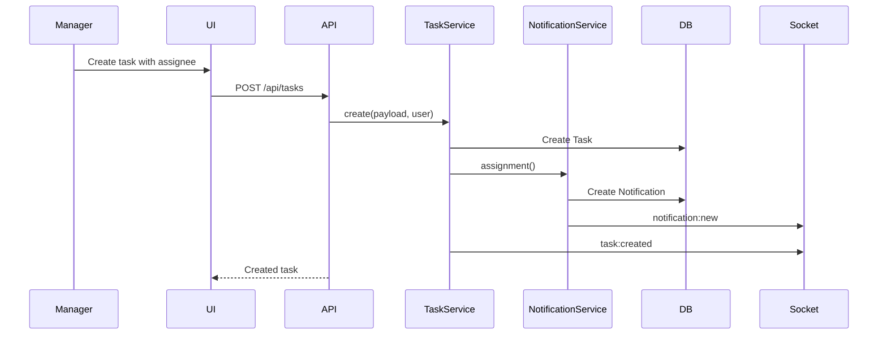
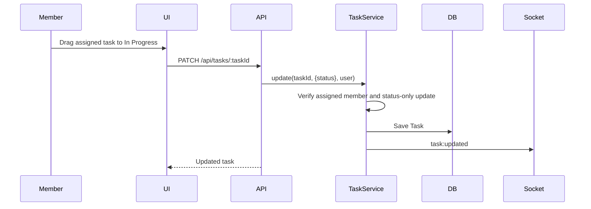
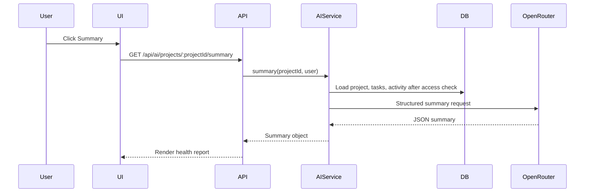

# WorkOS Low-Level Design

## 1. Purpose

This document explains the low-level design of WorkOS at module, API, schema, service, validation, and frontend component level. It is meant for maintainers and interview reviewers who want to understand how the implementation is organized and how requests move through the code.

## 2. Backend Module Design

### 2.1 Entry Points

| File | Responsibility |
|---|---|
| `backend/src/app.js` | Creates Express app, attaches middleware, mounts route modules, attaches error handling. |
| `backend/src/server.js` | Creates HTTP server, initializes Socket.IO, connects MongoDB, starts listener, schedules overdue scan. |

### 2.2 Config Modules

| File | Responsibility | Notes |
|---|---|---|
| `config/env.js` | Loads and validates environment variables. | Throws startup error when required vars are missing. |
| `config/db.js` | Connects Mongoose to MongoDB. | Uses `MONGO_URI`. |
| `config/openrouter.js` | Creates OpenRouter client through the OpenAI-compatible SDK if key exists. | AI endpoints return 503 if not configured. |

### 2.3 Middleware Modules

| Middleware | File | Responsibility |
|---|---|---|
| `authenticate` | `middlewares/auth.js` | Validates JWT, loads user, attaches `req.user`. |
| `authorize` | `middlewares/rbac.js` | Allows only specified roles. |
| `canManage` | `middlewares/rbac.js` | Shortcut for admin/manager operations. |
| `validate` | `middlewares/validate.js` | Runs Zod schema against body, params, query. |
| `notFound` | `middlewares/errorHandler.js` | Handles unknown routes. |
| `errorHandler` | `middlewares/errorHandler.js` | Returns consistent API errors. |

## 3. Database Schemas

### 3.1 User

| Field | Type | Required | Notes |
|---|---|---:|---|
| `name` | String | Yes | 2 to 80 characters. |
| `email` | String | Yes | Unique, lowercase, trimmed. |
| `password` | String | Yes | Hashed with bcrypt, excluded by default. |
| `role` | Enum | Yes | `admin`, `manager`, `member`; defaults to `member`. |
| `createdAt`, `updatedAt` | Date | Auto | Managed by Mongoose. |

### 3.2 Project

| Field | Type | Required | Notes |
|---|---|---:|---|
| `name` | String | Yes | Searchable text index. |
| `description` | String | No | Up to 2000 characters. |
| `createdBy` | ObjectId(User) | Yes | Project owner. |
| `members` | ObjectId(User)[] | No | Team members. |
| `createdAt`, `updatedAt` | Date | Auto | Managed by Mongoose. |

Indexes:

| Index | Purpose |
|---|---|
| `{ name: "text", description: "text" }` | Future search support. |
| `{ createdBy: 1 }` | Fast owner project lookup. |
| `{ members: 1 }` | Fast accessible project lookup. |

### 3.3 Task

| Field | Type | Required | Notes |
|---|---|---:|---|
| `title` | String | Yes | 2 to 160 characters. |
| `description` | String | No | Up to 8000 characters. |
| `projectId` | ObjectId(Project) | Yes | Parent project. |
| `assignedTo` | ObjectId(User) | No | Assignee. |
| `status` | Enum | Yes | `todo`, `in-progress`, `done`. |
| `dueDate` | Date | No | Used for overdue checks. |
| `completedAt` | Date | No | Set when task reaches Done. |

Indexes:

| Index | Purpose |
|---|---|
| `{ projectId: 1, status: 1 }` | Kanban board and project task query. |
| `{ assignedTo: 1, status: 1 }` | Workload and assigned task query. |
| `{ dueDate: 1 }` | Overdue scan. |

### 3.4 ActivityLog

| Field | Type | Required | Notes |
|---|---|---:|---|
| `action` | String | Yes | Domain action like `task.created`. |
| `entityType` | Enum | Yes | `project`, `task`, `user`, `notification`, `ai`. |
| `entityId` | ObjectId | No | Related document id. |
| `userId` | ObjectId(User) | Yes | Actor. |
| `projectId` | ObjectId(Project) | No | Project context. |
| `metadata` | Mixed | No | Extra event details. |

### 3.5 Notification

| Field | Type | Required | Notes |
|---|---|---:|---|
| `userId` | ObjectId(User) | Yes | Recipient. |
| `projectId` | ObjectId(Project) | No | Related project. |
| `taskId` | ObjectId(Task) | No | Related task. |
| `type` | Enum | Yes | `assignment`, `overdue`, `status`, `system`. |
| `message` | String | Yes | Display text. |
| `read` | Boolean | Yes | Defaults to false. |

## 4. Service Layer Details

### 4.1 Auth Service

| Method | Input | Output | Logic |
|---|---|---|---|
| `signup` | name, email, password, role | user, token | Prevent duplicate email, create local user, sign JWT. |
| `login` | email, password | user, token | Load password field, compare bcrypt hash, sign JWT. |
| `googleLogin` | Google credential ID token | user, token | Verify Google token, create/update Google-linked user, sign JWT. |

### 4.2 Project Service

| Method | Responsibility |
|---|---|
| `create` | Creates project with creator included in members and logs activity. |
| `list` | Returns projects accessible to user. |
| `get` | Fetches project after access filtering. |
| `update` | Updates project fields and logs activity. |
| `remove` | Deletes project and related tasks, logs activity. |
| `addMember` | Adds member using `$addToSet`, logs activity. |
| `removeMember` | Removes member using `$pull`, logs activity. |
| `assertProjectAccess` | Shared access guard for project-scoped services. |

Access logic:

| User Role | Project Query |
|---|---|
| Admin | `{}` |
| Manager/Member | `{ $or: [{ createdBy: user._id }, { members: user._id }] }` |

### 4.3 Task Service

| Method | Responsibility |
|---|---|
| `create` | Checks project access, creates task, notifies assignee, logs activity, emits socket event. |
| `list` | Lists tasks for a project after access check. |
| `update` | Applies task updates, enforces member restrictions, updates `completedAt`, emits event. |
| `remove` | Deletes task for admin/manager, logs activity, emits event. |

Member update rule:

| Condition | Result |
|---|---|
| User is not member role | Full allowed update based on route permission. |
| User is member and assigned to task | May update only `status`. |
| User is member and not assigned | Forbidden. |
| User is member and updates non-status field | Forbidden. |

### 4.4 Notification Service

| Method | Responsibility |
|---|---|
| `assignment` | Creates assignment notification and emits `notification:new`. |
| `overdueScan` | Finds overdue incomplete assigned tasks and creates overdue alerts. |
| `list` | Returns latest notifications for user. |
| `markRead` | Marks a notification read if it belongs to the user. |

### 4.5 Dashboard Service

| Metric | Calculation |
|---|---|
| Total tasks | Count tasks in accessible projects. |
| Completed tasks | Count tasks where status is `done`. |
| Pending tasks | Total minus completed. |
| Overdue tasks | Incomplete tasks with due date before now. |
| Completion rate | Completed / total * 100. |
| Average completion hours | Average of `completedAt - createdAt`. |
| Team workload | Group tasks by `assignedTo`, count total and done. |

### 4.6 AI Service

| Function | Context | Output Schema |
|---|---|---|
| `breakdown` | Optional project state plus user goal. | `tasks[]` with title, description, priority, estimatedHours, acceptanceCriteria. |
| `description` | Task title and optional project state. | Description, steps, edgeCases, acceptanceCriteria. |
| `suggestions` | Project, tasks, recent activity. | Suggested missing tasks. |
| `chat` | Project state plus question. | Answer, recommendedActions, risks. |
| `summary` | Project state and recent activity. | Summary, progress, delays, risks, nextSteps. |

AI safety and predictability:

| Control | Description |
|---|---|
| Access check before context | `getProjectContext` calls `assertProjectAccess`. |
| Structured output | OpenRouter Chat Completions `response_format` JSON schema format. |
| Low temperature | Reduces randomness for product workflows. |
| No direct writes | AI output is advisory; mutation happens only through normal task/project APIs. |

## 5. API Design

### 5.1 Auth APIs

| Method | Endpoint | Auth | Body | Response |
|---|---|---|---|---|
| POST | `/api/auth/signup` | No | name, email, password, role | user, token |
| POST | `/api/auth/login` | No | email, password | user, token |
| POST | `/api/auth/google` | No | Google ID token credential | user, token |
| GET | `/api/auth/me` | Yes | None | user |

### 5.2 Project APIs

| Method | Endpoint | Roles | Purpose |
|---|---|---|---|
| GET | `/api/projects` | Authenticated | List accessible projects. |
| POST | `/api/projects` | Admin, Manager | Create project. |
| GET | `/api/projects/:projectId` | Authenticated | Get project details. |
| PATCH | `/api/projects/:projectId` | Admin, Manager | Update project. |
| DELETE | `/api/projects/:projectId` | Admin, Manager | Delete project. |
| GET | `/api/projects/:projectId/activity` | Authenticated | Get project activity. |
| POST | `/api/projects/:projectId/members/:memberId` | Admin, Manager | Add member. |
| DELETE | `/api/projects/:projectId/members/:memberId` | Admin, Manager | Remove member. |

### 5.3 Task APIs

| Method | Endpoint | Roles | Purpose |
|---|---|---|---|
| GET | `/api/tasks/project/:projectId` | Authenticated | List project tasks. |
| POST | `/api/tasks` | Admin, Manager | Create task. |
| PATCH | `/api/tasks/:taskId` | Authenticated | Update task. Members are restricted by service rule. |
| DELETE | `/api/tasks/:taskId` | Admin, Manager | Delete task. |

### 5.4 AI APIs

| Method | Endpoint | Auth | Purpose |
|---|---|---|---|
| POST | `/api/ai/breakdown` | Yes | Convert goal to structured subtasks. |
| POST | `/api/ai/description` | Yes | Generate detailed task description. |
| GET | `/api/ai/projects/:projectId/suggestions` | Yes | Suggest missing tasks. |
| GET | `/api/ai/projects/:projectId/summary` | Yes | Summarize project health. |
| POST | `/api/ai/projects/:projectId/chat` | Yes | Answer project-state questions. |

### 5.5 Supporting APIs

| Method | Endpoint | Purpose |
|---|---|---|
| GET | `/api/dashboard` | Analytics overview. |
| GET | `/api/notifications` | List notifications. |
| PATCH | `/api/notifications/:notificationId/read` | Mark notification read. |
| GET | `/api/users` | Admin/manager user list for member assignment. |
| GET | `/health` | Backend health check. |

## 6. Validation Design

| Schema Group | File | Examples |
|---|---|---|
| `authSchemas` | `validators/schemas.js` | Signup/login validation. |
| `projectSchemas` | `validators/schemas.js` | Project id, create, update, member routes. |
| `taskSchemas` | `validators/schemas.js` | Task create/update/list/delete. |
| `aiSchemas` | `validators/schemas.js` | Breakdown, description, chat, project AI params. |
| `notificationSchemas` | `validators/schemas.js` | Mark-read id validation. |

ObjectId validation uses a 24-character MongoDB ObjectId regex. Dates use `z.coerce.date()` so ISO strings from the frontend are converted before service execution.

## 7. Frontend Low-Level Design

### 7.1 Routing

| Route | Component | Purpose |
|---|---|---|
| `/login` | `Login` | User login. |
| `/signup` | `Login` | User signup. |
| `/dashboard` | `Dashboard` | Analytics overview. |
| `/projects` | `Projects` | Project list and create form. |
| `/projects/:projectId` | `ProjectDetail` | Kanban board, task form, members, AI, activity. |

### 7.2 Frontend State

| State | Owner | Purpose |
|---|---|---|
| Auth user | `AuthContext` | Holds current user and login/logout actions. |
| JWT | `localStorage` | Persist session across refreshes. |
| Projects | `Projects` page | Project list. |
| Project tasks | `ProjectDetail` | Kanban data and socket updates. |
| Notifications | `Layout` | Header unread count and real-time notification updates. |
| AI output | `AiPanel` | Displays generated tasks, summaries, chat answers. |

### 7.3 Component Responsibilities

| Component | Responsibility |
|---|---|
| `Layout` | Sidebar, topbar, notification socket listener, logout. |
| `ProtectedRoute` | Redirect unauthenticated users. |
| `Dashboard` | Fetch and render analytics. |
| `Projects` | List/create projects. |
| `ProjectDetail` | Orchestrate project data, tasks, socket events, members, AI. |
| `KanbanBoard` | Drag/drop task status updates. |
| `TaskForm` | Create task and invoke AI description generator. |
| `MemberManager` | Add/remove project members. |
| `AiPanel` | Run AI breakdown, suggestions, summary, and chat. |

## 8. Socket.IO Low-Level Design

| Function | Responsibility |
|---|---|
| `initSocket(io)` | Adds optional JWT auth, handles project room join/leave, joins user room. |
| `emitProjectEvent(projectId, event, payload)` | Emits to `project:{projectId}` room. |
| `emitUserEvent(userId, event, payload)` | Emits to `user:{userId}` room. |

Client flow:

1. Authenticated user loads app.
2. Socket client connects with JWT in `auth.token`.
3. Layout listens for `notification:new`.
4. Project detail emits `project:join`.
5. Task changes are received as `task:created`, `task:updated`, or `task:deleted`.

## 9. Error Response Design

| Case | Status | Response Shape |
|---|---:|---|
| Validation error | 400 | `{ success: false, message, details }` |
| Missing/invalid token | 401 | `{ success: false, message }` |
| Forbidden action | 403 | `{ success: false, message }` |
| Missing resource | 404 | `{ success: false, message }` |
| AI not configured | 503 | `{ success: false, message }` |
| Unexpected error | 500 | Production-safe message. |

## 10. Important Flows

### 10.1 Task Assignment Flow

### 10.2 Member Status Update Flow

### 10.3 AI Summary Flow

## 11. Extension Points

| Future Feature | Best Place to Add |
|---|---|
| Comments | Add `Comment` model, `commentService`, task detail UI. |
| File attachments | Add storage service and task attachment model. |
| Sprint planning | Add `Sprint` model and project route/service modules. |
| Email notifications | Extend `notificationService` with email provider. |
| Redis socket scaling | Replace in-memory Socket.IO adapter in `server.js`. |
| Background jobs | Move overdue scan into BullMQ or Railway cron. |
| Test suite | Add Jest/Vitest and Supertest around services/routes. |
