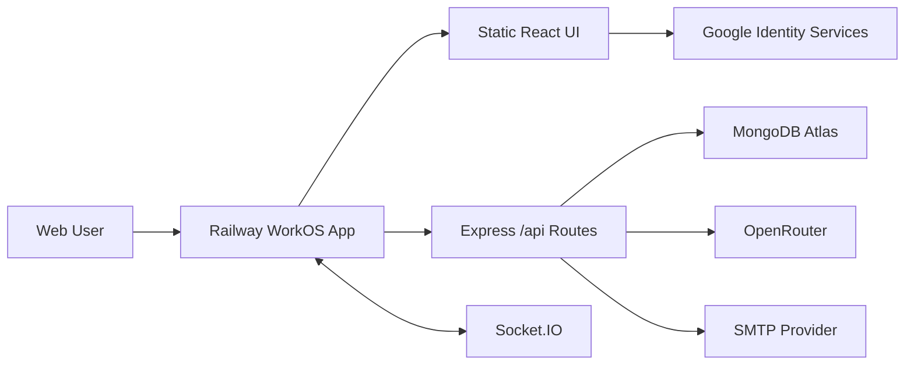

# WorkOS Software Requirements and Context

## Document Control

| Field | Value |
|---|---|
| Project | AI-Assisted Team Task Manager (WorkOS) |
| Document Type | Software Requirements and Context (SRC) |
| Version | 2.0 |
| Last Updated | May 7, 2026 |
| Primary Audience | Interviewers, engineering reviewers, maintainers |
| Live App | https://workos-production-0d1c.up.railway.app/ |
| Repository | https://github.com/ashwanibaghel/WorkOS |

## 1. Executive Summary

WorkOS is a production-style full-stack SaaS task manager for teams. It enables users to create projects, manage teams, assign tasks, track Kanban status, receive real-time notifications, review activity logs, inspect analytics, and use AI for planning and decision support.

The project is intentionally designed to demonstrate real engineering maturity: layered backend architecture, RBAC, validation, auditability, real-time updates, role-specific dashboards, environment-driven configuration, Railway deployment, and practical AI integration through OpenRouter.

## 2. Product Vision

| Area | Description |
|---|---|
| Vision | Help teams plan and execute work through deterministic task-management workflows plus selective AI assistance. |
| Target Users | Admins, managers, members, interviewers, engineering reviewers. |
| Core Value | Clear team collaboration, role-specific workflow, and project-state visibility. |
| Differentiator | AI is used where reasoning helps; backend owns permissions, data writes, and metrics. |
| Deployment Goal | One live Railway URL that serves frontend, backend API, sockets, and health check. |

## 3. Current Production Context

| Item | Value |
|---|---|
| Live Website | https://workos-production-0d1c.up.railway.app/ |
| Health Check | https://workos-production-0d1c.up.railway.app/health |
| Hosting | Railway single service |
| Database | MongoDB Atlas via `MONGO_URI` |
| AI Provider | OpenRouter via `OPENROUTER_API_KEY` |
| Google Login | Google Identity Services credential flow |
| Local Email Verification | SMTP in production; dev fallback link in development |

## 4. Goals

| ID | Goal | Status |
|---|---|---:|
| G-01 | Build a full-stack project/task management SaaS application. | Done |
| G-02 | Implement secure authentication with JWT, password hashing, email verification, and Google login. | Done |
| G-03 | Enforce role-based access through middleware and service rules. | Done |
| G-04 | Provide separate Admin, Manager, and Member dashboards. | Done |
| G-05 | Support real-time task and notification updates. | Done |
| G-06 | Capture activity logs for auditability. | Done |
| G-07 | Provide productivity analytics and workload visibility. | Done |
| G-08 | Integrate AI only for planning/summarization/decision support. | Done |
| G-09 | Deploy live on Railway with no hardcoded secrets. | Done |
| G-10 | Provide professional README, HLD, LLD, and SRC documentation. | Done |

## 5. Non-Goals and Current Limitations

| Non-Goal / Limitation | Reason or Future Path |
|---|---|
| Billing/subscriptions | Not needed for architecture demonstration. |
| File attachments | Can be added with object storage later. |
| Comments/threaded discussions | Future task detail extension. |
| Refresh token rotation | JWT bearer token currently used; refresh tokens can be added as security enhancement. |
| Google PKCE code exchange | Current code uses Google Identity ID token verification, which is simpler for demo login. |
| Multi-instance socket scaling | Current Socket.IO rooms are in-memory; Redis adapter can be added for horizontal scale. |
| Production local-email signup without SMTP | Current production design requires SMTP so unverified local accounts cannot bypass verification. |

## 6. Stakeholders

| Stakeholder | Need |
|---|---|
| Admin | Global control, user role management, project visibility, risk insights. |
| Manager | Create projects, manage team members, assign tasks, track delivery and blockers. |
| Member | Focused queue, assigned task status updates, overdue awareness. |
| Interviewer | Clear evidence of architecture, security, scalability, and product thinking. |
| Maintainer | Predictable modules, validation contracts, services, docs, and deployment steps. |

## 7. Roles and Permissions

| Role | Capabilities | Restrictions |
|---|---|---|
| Admin | View all projects, create/update/delete projects, manage users, update roles, manage teams, assign tasks, use AI, view dashboards. | Cannot change their own role through role update endpoint. |
| Manager | Create projects, manage own/access projects, add member users, create/assign/delete tasks, move tasks, use AI, view manager dashboard. | Cannot assign another project lead; cannot add admin/manager as normal project members; cannot update roles. |
| Member | View assigned/member projects, view project context, move status of assigned tasks, use AI assistant, view member dashboard. | Cannot create/delete tasks, assign users, manage team, or move unassigned/other users' tasks. |

## 8. Manager and Member Workflow

| Step | Manager Action | Member Action |
|---|---|---|
| 1 | Create a project with description, category, priority, delivery mode, dates, goals, and success criteria. | Project becomes visible only after membership/access. |
| 2 | Add member users to the project team. | See project context, goals, task board, and AI assistant. |
| 3 | Create tasks manually or from AI suggestions. | Receive assignment notifications. |
| 4 | Assign tasks to members with due dates. | Work on assigned tasks and move status. |
| 5 | Review Kanban, workload, overdue alerts, AI recommendations, and activity. | Focus on next best task, personal queue, overdue alerts. |
| 6 | Use activity log and dashboard to identify execution risk. | Use project/member AI for clarity and next action guidance. |

## 9. Functional Requirements

### 9.1 Authentication

| ID | Requirement | Priority | Implementation |
|---|---|---:|---|
| FR-AUTH-01 | User can sign up with name, email, password, password confirmation. | Must | `POST /api/auth/signup` |
| FR-AUTH-02 | Signup password must satisfy policy. | Must | Zod `strongPassword`. |
| FR-AUTH-03 | Password must be hashed before persistence. | Must | Mongoose pre-save hook with bcrypt. |
| FR-AUTH-04 | Local users must verify email before normal login. | Must | Verification token flow in `authService`. |
| FR-AUTH-05 | User can request another verification link. | Should | `POST /api/auth/resend-verification` |
| FR-AUTH-06 | User can login with email/password after verification. | Must | `POST /api/auth/login` |
| FR-AUTH-07 | User can login with Google credential. | Must | `POST /api/auth/google` |
| FR-AUTH-08 | Protected APIs require JWT. | Must | `authenticate` middleware. |
| FR-AUTH-09 | Logged-in user can fetch profile. | Must | `GET /api/auth/me` |
| FR-AUTH-10 | First registered user becomes admin; later signups default to member. | Must | `authService.signup`. |

### 9.2 User and Role Management

| ID | Requirement | Priority | Implementation |
|---|---|---:|---|
| FR-USER-01 | Admin/manager can list users for team assignment. | Must | `GET /api/users` |
| FR-USER-02 | Admin can update another user's role. | Must | `PATCH /api/users/:userId/role` |
| FR-USER-03 | Admin cannot change own role from the endpoint. | Should | `userService.updateRole` |
| FR-USER-04 | Non-admin cannot update roles. | Must | `authorize("admin")` |

### 9.3 Project Management

| ID | Requirement | Priority | Implementation |
|---|---|---:|---|
| FR-PRJ-01 | Admin/manager can create projects. | Must | `POST /api/projects` |
| FR-PRJ-02 | Project supports metadata: category, priority, status, delivery mode, lead, dates, goals, success criteria, tags. | Must | `Project` schema and `projectSchemas`. |
| FR-PRJ-03 | User can list accessible projects. | Must | `projectService.list` |
| FR-PRJ-04 | User can view accessible project detail. | Must | `projectService.get` |
| FR-PRJ-05 | Admin/manager can update project metadata. | Must | `PATCH /api/projects/:projectId` |
| FR-PRJ-06 | Admin/manager can delete accessible projects and related tasks. | Must | `DELETE /api/projects/:projectId` |
| FR-PRJ-07 | Manager-created project uses manager as project lead. | Must | `buildCreatePayload`. |
| FR-PRJ-08 | Admin-selected project lead must be admin/manager. | Must | `assertAdminLead`. |

### 9.4 Team Management

| ID | Requirement | Priority | Implementation |
|---|---|---:|---|
| FR-TEAM-01 | Admin/manager can add project members. | Must | `POST /api/projects/:projectId/members/:memberId` |
| FR-TEAM-02 | Admin/manager can remove project members. | Must | `DELETE /api/projects/:projectId/members/:memberId` |
| FR-TEAM-03 | Manager can add/remove only member users. | Must | `assertManagerMemberScope`. |
| FR-TEAM-04 | Project members include creator and lead. | Must | Payload normalization in project service. |

### 9.5 Task Management

| ID | Requirement | Priority | Implementation |
|---|---|---:|---|
| FR-TASK-01 | Admin/manager can create tasks. | Must | `POST /api/tasks` |
| FR-TASK-02 | Task supports title, description, project, assignee, status, due date. | Must | `Task` schema. |
| FR-TASK-03 | Task status supports Todo, In Progress, Done. | Must | `status` enum. |
| FR-TASK-04 | Completion timestamp is set when task becomes Done. | Must | `taskService.update`. |
| FR-TASK-05 | Member can update only status of assigned tasks. | Must | `assertMemberCanUpdate`. |
| FR-TASK-06 | Manager can assign tasks only to member users. | Must | `assertAssignableAssignee`. |
| FR-TASK-07 | Task changes emit real-time project events. | Must | Socket.IO project rooms. |

### 9.6 Dashboard and Analytics

| ID | Requirement | Priority | Implementation |
|---|---|---:|---|
| FR-DASH-01 | Dashboard must be role-specific. | Must | `Dashboard.jsx` chooses Admin/Manager/Member component. |
| FR-DASH-02 | Admin sees system metrics and user controls. | Must | `AdminDashboard.jsx`. |
| FR-DASH-03 | Manager sees delivery/workload/Kanban view. | Must | `ManagerDashboard.jsx`. |
| FR-DASH-04 | Member sees focus/task productivity view. | Must | `MemberDashboard.jsx`. |
| FR-DASH-05 | Dashboard reports total, pending, done, overdue, unassigned, completion rate, workload, average completion. | Must | `dashboardService.overview`. |
| FR-DASH-06 | Dashboard includes deterministic risk alerts and AI insight strings. | Should | `buildInsights`. |

### 9.7 Real-Time Updates

| ID | Requirement | Priority | Implementation |
|---|---|---:|---|
| FR-RT-01 | Task created/updated/deleted events update project UI without refresh. | Must | `emitProjectEvent`. |
| FR-RT-02 | Assignment/overdue notifications are pushed to user room. | Must | `emitUserEvent`. |
| FR-RT-03 | Project detail page joins/leaves project room. | Must | `ProjectDetail.jsx`. |

### 9.8 Notifications and Activity Log

| ID | Requirement | Priority | Implementation |
|---|---|---:|---|
| FR-NOT-01 | Create assignment notification. | Must | `notificationService.assignment`. |
| FR-NOT-02 | Scan and alert overdue assigned tasks. | Must | `notificationService.overdueScan`. |
| FR-NOT-03 | User can list notifications. | Must | `GET /api/notifications`. |
| FR-NOT-04 | User can mark notification read. | Should | `PATCH /api/notifications/:notificationId/read`. |
| FR-AUD-01 | Project/task/member/AI actions are logged. | Must | `activityService.log`. |
| FR-AUD-02 | Project activity is visible. | Must | `GET /api/projects/:projectId/activity`. |

### 9.9 AI Features

| ID | Feature | Input | Output | Boundary |
|---|---|---|---|---|
| FR-AI-01 | Task Breakdown | Goal + optional project id | Structured tasks | AI suggests, API creates only after user action. |
| FR-AI-02 | Smart Description | Task title + optional project id | Description, steps, edge cases, criteria | AI drafts text only. |
| FR-AI-03 | Context Suggestions | Project state | Missing task ideas | No direct writes. |
| FR-AI-04 | Project Chat | Project state + question | Answer, actions, risks | Access checked before context. |
| FR-AI-05 | Dashboard Chat | Role dashboard context + question | Answer, actions, risks | Role-scoped overview only. |
| FR-AI-06 | Project Summary | Project, tasks, activity | Summary, progress, delays, risks, next steps | Summarizes deterministic state. |

## 10. Non-Functional Requirements

| Category | Requirement | Implementation |
|---|---|---|
| Security | No hardcoded secrets. | `.env` ignored, `.env.example` placeholders. |
| Security | JWT-protected APIs reject unauthorized users. | `authenticate` middleware. |
| Security | Role checks are centralized. | RBAC middleware plus service rules. |
| Security | Email verification tokens are not stored raw. | SHA-256 token hash. |
| Security | Google login validates token audience. | `google-auth-library`. |
| Validation | All write inputs are validated. | Zod schemas. |
| Reliability | API errors have consistent shape. | `AppError`, `errorHandler`. |
| Auditability | Important domain actions are logged. | ActivityLog collection. |
| Realtime | Task and notification state updates without refresh. | Socket.IO rooms. |
| Deployability | App runs on Railway as a single service. | Root `railway.json`, static frontend serving. |
| Maintainability | Business logic is isolated from controllers. | Service layer. |
| Scalability | Common queries are indexed. | Mongoose indexes. |

## 11. System Context

## 12. Data Requirements

| Entity | Purpose | Key Fields |
|---|---|---|
| User | Authenticated actor and RBAC identity. | name, email, password, role, authProvider, googleId, isEmailVerified |
| Project | Team workspace and planning container. | name, description, category, priority, status, deliveryMode, projectManager, dates, goals, successCriteria, tags, createdBy, members |
| Task | Trackable work item. | title, description, projectId, assignedTo, status, dueDate, completedAt |
| ActivityLog | Audit trail. | action, entityType, entityId, userId, projectId, metadata |
| Notification | User-facing alert. | userId, projectId, taskId, type, message, read |

## 13. Deployment Requirements

| Requirement | Current Status |
|---|---|
| Backend deployed on Railway | Done |
| Frontend deployed and reachable | Done, served by same Railway service |
| MongoDB Atlas connected | Supported through `MONGO_URI` |
| OpenRouter key configurable | Supported through `OPENROUTER_API_KEY` |
| Google login domain configurable | Add Railway URL to Google authorized JavaScript origins |
| No secrets committed | `.env` ignored; examples contain placeholders |
| Health check available | `/health` |

## 14. Success Criteria

| Criterion | Expected Result |
|---|---|
| Reviewer can open live app | `https://workos-production-0d1c.up.railway.app/` loads frontend. |
| Reviewer can inspect backend health | `/health` returns success JSON. |
| Architecture is understandable | README, HLD, LLD, SRC clearly describe layers and flows. |
| RBAC is meaningful | Same account cannot self-select arbitrary role; admin controls roles. |
| Manager/member workflows are distinct | Manager plans/assigns; member executes assigned work. |
| AI is practical | AI assists planning and summaries without bypassing deterministic rules. |
| Codebase is production-shaped | Routes, controllers, services, models, middleware, validation, env config. |
| Deployment is reproducible | Railway root deployment works from repo with env vars. |

## 15. Reviewer Checklist

| Review Item | Where to Look |
|---|---|
| Layered backend | `backend/src/controllers`, `backend/src/services`, `backend/src/models` |
| RBAC | `backend/src/middlewares/rbac.js`, `projectService.js`, `taskService.js` |
| Auth and email verification | `backend/src/services/authService.js`, `emailService.js` |
| Project schema richness | `backend/src/models/Project.js` |
| AI boundary | `backend/src/services/aiService.js` |
| Role dashboards | `frontend/src/components/dashboard` |
| Project detail workflow | `frontend/src/pages/ProjectDetail.jsx` |
| Railway deployment | `railway.json`, `backend/src/app.js` |
