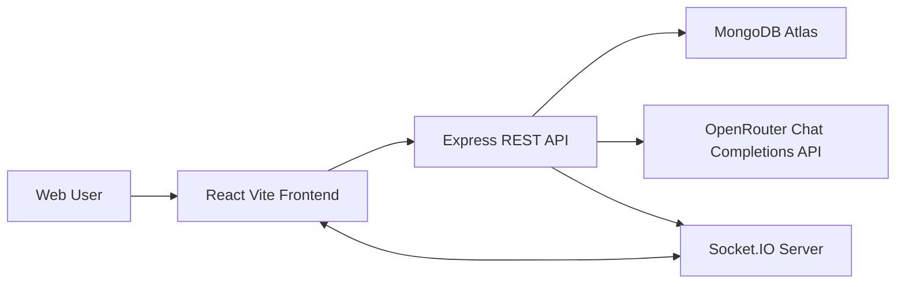

# WorkOS Software Requirements and Context Document

## 1. Document Control

| Field | Value |
|---|---|
| Project | AI-Assisted Team Task Manager (WorkOS) |
| Document Type | Software Requirements and Context (SRC) |
| Version | 1.0 |
| Primary Audience | Interviewers, engineering reviewers, project evaluators, maintainers |
| System Type | Full-stack SaaS-style team task management application |
| Repository | `E:\WorkOS` |

## 2. Executive Summary

WorkOS is a production-oriented team task manager for creating projects, managing members, assigning tasks, tracking progress, receiving notifications, and using AI where deterministic software rules are insufficient.

The application is intentionally designed as more than a CRUD demo. It demonstrates backend architecture, RBAC, auditability, real-time updates, analytics, validation, deployment readiness, and practical AI usage through OpenRouter APIs. AI is used only for reasoning-heavy productivity workflows such as breaking down natural language goals, generating rich task descriptions, summarizing project health, and answering project-state questions.

## 3. Product Vision

| Area | Description |
|---|---|
| Vision | Help teams plan, execute, and monitor work with deterministic task-management workflows and selective AI assistance. |
| Target Users | Admins, project managers, engineering team members, hiring managers reviewing architecture quality. |
| Core Value | Clean collaboration workflow with real-time visibility and context-aware AI productivity support. |
| Differentiator | Clear boundary between business rules and AI reasoning, making the system explainable and production-friendly. |

## 4. Goals and Non-Goals

### 4.1 Goals

| Goal | Description |
|---|---|
| Project management | Users can create, view, update, delete, and organize team projects. |
| Task management | Managers can create and assign tasks; members can update assigned task status. |
| Team management | Managers/admins can add or remove project members. |
| RBAC | Authorization is enforced through backend middleware and service-level rules. |
| Real-time collaboration | Task and notification events are pushed over Socket.IO. |
| Audit trail | Important actions are recorded as activity logs. |
| Analytics | Dashboard reports task counts, completion rate, overdue tasks, average completion time, and workload. |
| AI assistance | AI assists with task breakdown, task descriptions, suggestions, chat, and project summaries. |
| Deployment readiness | Environment variables, Railway/Vercel configuration, MongoDB Atlas support, and clean setup docs are included. |

### 4.2 Non-Goals

| Non-Goal | Reason |
|---|---|
| Enterprise billing | Out of scope for task-management architecture demonstration. |
| File attachments | Can be added later through object storage but not required for core workflow. |
| Calendar integration | Useful future extension, not required for current product goal. |
| Complex sprint planning | Current model focuses on projects and tasks. |
| AI replacing permissions | AI never decides access control, role capabilities, or database mutations. |

## 5. Stakeholders

| Stakeholder | Interest |
|---|---|
| Admin | Full control over platform data and users. |
| Manager | Project execution, task assignment, team workload, progress tracking. |
| Member | Assigned work, status updates, notifications. |
| Hiring Manager | Architecture quality, maintainability, practical AI integration, production readiness. |
| Maintainer | Clear folder structure, predictable services, low-risk feature extension. |

## 6. User Roles and Permissions

| Role | Capabilities | Restrictions |
|---|---|---|
| Admin | Full project/task access, manage projects, manage members, view analytics, use AI features. | None within current product scope. |
| Manager | Create/update/delete projects, manage project members, create/assign/delete tasks, view analytics, use AI features. | Access limited to projects they created or belong to unless admin privileges are added. |
| Member | View accessible projects, view tasks, update status of assigned tasks, use project AI assistant. | Cannot create/delete tasks, assign users, manage members, or update unassigned tasks. |

## 7. Functional Requirements

### 7.1 Authentication

| ID | Requirement | Priority | Implementation |
|---|---|---|---|
| FR-AUTH-01 | User can sign up with name, email, password, and role. | Must | `POST /api/auth/signup` |
| FR-AUTH-02 | User can log in with email and password. | Must | `POST /api/auth/login` |
| FR-AUTH-03 | User can log in with Google OAuth ID token. | Must | `POST /api/auth/google` |
| FR-AUTH-04 | Passwords must be hashed before persistence. | Must | `User` model pre-save hook with bcrypt. |
| FR-AUTH-05 | API access requires JWT for protected routes. | Must | `authenticate` middleware. |
| FR-AUTH-06 | Logged-in user can fetch current profile. | Must | `GET /api/auth/me` |

### 7.2 Project Management

| ID | Requirement | Priority | Implementation |
|---|---|---|---|
| FR-PRJ-01 | Admin/manager can create projects. | Must | `projectService.create` |
| FR-PRJ-02 | User can list accessible projects. | Must | `projectService.list` |
| FR-PRJ-03 | User can view project details. | Must | `projectService.get` |
| FR-PRJ-04 | Admin/manager can update project name/description/members. | Must | `projectService.update` |
| FR-PRJ-05 | Admin/manager can delete projects and related tasks. | Must | `projectService.remove` |
| FR-PRJ-06 | Admin/manager can add or remove members. | Must | `addMember`, `removeMember` |

### 7.3 Task Management

| ID | Requirement | Priority | Implementation |
|---|---|---|---|
| FR-TASK-01 | Admin/manager can create tasks. | Must | `taskService.create` |
| FR-TASK-02 | Tasks support title, description, project, assignee, status, and due date. | Must | `Task` model. |
| FR-TASK-03 | Task status supports Todo, In Progress, Done. | Must | `status` enum. |
| FR-TASK-04 | Task completion time is captured when status becomes Done. | Must | `completedAt` logic in `taskService.update`. |
| FR-TASK-05 | Member can update only status of assigned tasks. | Must | `assertMemberCanUpdate`. |
| FR-TASK-06 | Task changes emit real-time project events. | Must | Socket.IO project rooms. |

### 7.4 Dashboard and Analytics

| ID | Requirement | Priority | Implementation |
|---|---|---|---|
| FR-AN-01 | Show total task count. | Must | `dashboardService.overview` |
| FR-AN-02 | Show completed and pending tasks. | Must | `dashboardService.overview` |
| FR-AN-03 | Show overdue tasks. | Must | Due date aggregation. |
| FR-AN-04 | Show completion rate. | Must | Completed / total calculation. |
| FR-AN-05 | Show average completion time. | Must | MongoDB aggregation over `completedAt - createdAt`. |
| FR-AN-06 | Show team workload. | Must | MongoDB group by `assignedTo`. |

### 7.5 Notifications

| ID | Requirement | Priority | Implementation |
|---|---|---|---|
| FR-NOT-01 | Notify users when assigned to a task. | Must | `notificationService.assignment` |
| FR-NOT-02 | Notify assigned users about overdue tasks. | Must | `notificationService.overdueScan` |
| FR-NOT-03 | Users can list notifications. | Must | `GET /api/notifications` |
| FR-NOT-04 | Users can mark notifications as read. | Should | `PATCH /api/notifications/:id/read` |
| FR-NOT-05 | New notifications are pushed in real time. | Must | `emitUserEvent` |

### 7.6 Activity Log

| ID | Requirement | Priority | Implementation |
|---|---|---|---|
| FR-AUD-01 | Project creation/update/delete is logged. | Must | `activityService.log` |
| FR-AUD-02 | Member add/remove is logged. | Must | `projectService` |
| FR-AUD-03 | Task create/update/delete is logged. | Must | `taskService` |
| FR-AUD-04 | Project activity can be viewed. | Must | `GET /api/projects/:projectId/activity` |

### 7.7 AI Features

| ID | Feature | Input | Output | Deterministic Boundary |
|---|---|---|---|---|
| FR-AI-01 | Task Breakdown | Natural language goal | Structured task list | AI suggests; backend/user decides creation. |
| FR-AI-02 | Description Generator | Task title | Description, steps, edge cases, criteria | AI drafts text only. |
| FR-AI-03 | Context Suggestions | Project state | Missing task suggestions | AI cannot mutate database directly. |
| FR-AI-04 | AI Chat Assistant | Question + project state | Answer, actions, risks | AI is advisory only. |
| FR-AI-05 | Project Summary | Project, tasks, activity | Summary, progress, risks, next steps | AI summarizes deterministic state. |

## 8. Non-Functional Requirements

| Category | Requirement | Implementation |
|---|---|---|
| Security | No hardcoded secrets. | `.env.example`, env loader. |
| Security | Passwords must be hashed. | bcrypt. |
| Security | Protected routes require JWT. | Auth middleware. |
| Security | Role checks must be centralized. | RBAC middleware and service rules. |
| Validation | API input must be validated. | Zod schemas. |
| Reliability | Errors must have consistent response shape. | `AppError`, error middleware. |
| Scalability | Data queries should use indexes. | Mongoose indexes on project/task/log fields. |
| Maintainability | Business logic must be outside controllers. | Service layer. |
| Observability | Important actions must be auditable. | Activity log model. |
| Real-time | UI should update without refresh for task events. | Socket.IO rooms. |
| Deployability | App should be deployable to Railway/Vercel. | Config files and README. |

## 9. System Context

## 10. Data Requirements

| Entity | Purpose | Key Fields |
|---|---|---|
| User | Authenticated actor and RBAC identity. | name, email, password, role |
| Project | Team workspace for tasks and members. | name, description, createdBy, members |
| Task | Trackable work item. | title, description, projectId, assignedTo, status, dueDate, completedAt |
| ActivityLog | Audit trail. | action, entityType, entityId, userId, projectId, metadata |
| Notification | User-facing event message. | userId, projectId, taskId, type, message, read |

## 11. Success Criteria

| Criterion | Expected Result |
|---|---|
| Architecture clarity | Reviewer can identify controller, service, model, middleware, and AI boundaries. |
| Feature completeness | Core project/task/member/dashboard/AI flows are implemented. |
| Production readiness | Env config, validation, RBAC, error handling, deployment steps exist. |
| Practical AI usage | AI is used for reasoning and text generation, not deterministic business decisions. |
| Interview readability | README and docs explain the project quickly and credibly. |
